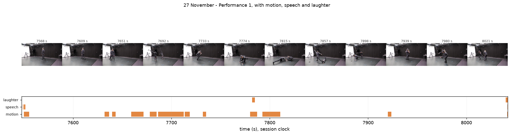
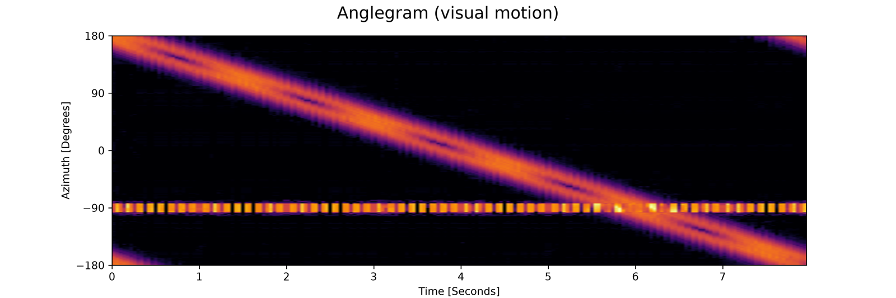
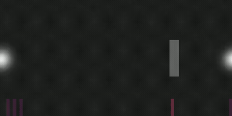

# Gallery

Every picture below is something the toolbox makes, rendered from the bundled example
videos. Click any image to open the page that explains the function behind it. If you
know what you want an analysis to look like but not what it is called, this page is
the index to use.

## Looking at a recording

| | | |
|---|---|---|
|  |  |  |
| motion video | motiongram | videogram |
|  |  |  |
| average image | history video | motion heatmap |
|  |  |  |
| stroboscope | silhouette waterfall | motion history image |
|  |  |  |
| contact sheet | multi-shot | Eulerian magnification |

## Measuring motion

| | | |
|---|---|---|
|  |  |  |
| motion descriptors | optical flow | motion vectors |
|  |  |  |
| movement tempo | directograms | self-similarity matrix |

## Bodies: positions and postures

| | | |
|---|---|---|
|  |  |  |
| pose landmarks | pose timeline | posegram |
|  |  |  |
| average pose | centred pose | skeleton timeline |
|  |  |  |
| effort profile | pose waterfall | postural sway |

## Sound, and sound with movement

| | | |
|---|---|---|
|  |  |  |
| spectrogram | tempogram | chromagram |
|  |  |  |
| phase synchrony | tempo similarity | body–audio coupling |
|  |  |  |
| pulse segmentation | cross-modal alignment | structure comparison |

## Rooms, segments, and special formats

| | | |
|---|---|---|
|  |  |  |
| room plate | impacts | annotation timeline |
|  |  |  |
| anglegram (360) | audio-energy map (360) | grid quantity of motion |
