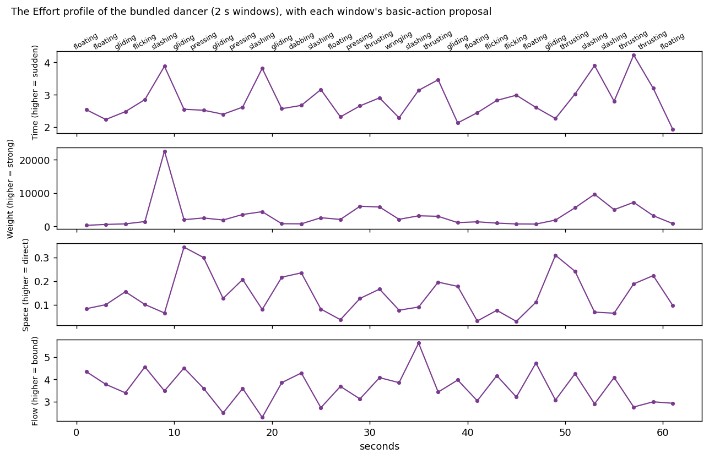
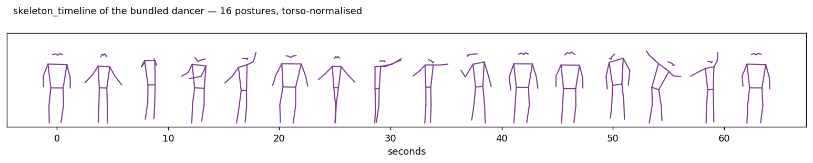

# Effort

Continuous indices for the qualities of movement, after Rudolf Laban.

## What Laban's Effort is

Laban Movement Analysis describes movement through four elements—body, space,
shape, and effort—and effort is the one about *quality*: not what moves or where,
but how. A movement can cover the same trajectory hurried or calm, grounded or
weightless, and effort names that difference. It is an observational system,
approached—as the choreographer Andre Austvold taught it in Oslo—by looking at the
intention of the movement, "placing yourself within the body of your subject".

Effort has four motion factors, each a continuum between two poles
(Laban & Lawrence, 1947; Hackney, 2002):

| factor | poles |
|---|---|
| Weight | light ↔ strong/firm |
| Time | sustained ↔ sudden |
| Space | indirect/flexible ↔ direct |
| Flow | free ↔ bound |

Two things about the system matter before any computation. Effort describes
*fluctuation*, not level: the analysis is of a movement getting firmer or gentler
over a phrase, so its natural output is a contour, and a single number for a whole
recording flattens what the concept is about (Haga, 2008). And effort is the
qualitative reading on top of an intensity contour: a quantity-of-motion curve says
how much movement there is, and famously says it indiscriminately—a dancer moving
their whole body reads high however the movement feels (Jensenius, 2007)—where
effort says how the movement is performed.

## What MGT computes

`musicalgestures._effort` is MGT's own operationalisation of the four factors—and
is named as such, because every computational version of an observational system is
somebody's operationalisation. Each function takes plain arrays and a sample rate,
so mocap speeds, pose trajectories, and quantity-of-motion tracks all qualify.

| factor | function | index | direction |
|---|---|---|---|
| Time | `effort_time` | burst concentration of the speed profile | higher = more sudden |
| Weight | `effort_weight` | peak (p95) acceleration | higher = stronger |
| Space | `effort_space` | path directness per window | higher = more direct |
| Flow | `effort_flow` | boundness, from spectral arc length | higher = more bound |

`effort_profile` computes all four in windows on one clock—the contour form the
concept asks for—and `basic_effort_actions` condenses each window into one of
Laban's eight basic effort actions (thrusting, slashing, pressing, wringing,
dabbing, flicking, gliding, floating): his own combinations of the Weight, Time
and Space poles, with Flow as a further colouring element outside the combination
(Laban, 1971; Haga, 2008). The poles are read against the mover's own medians, so
a label says which octant of *this mover's* range a window falls in. The labels
are proposals for looking with, never classifications.



```python
import numpy as np
from musicalgestures._effort import effort_profile, basic_effort_actions

xy = np.load("trajectory.npy")        # (frames, 2) positions, e.g. a wrist
profile = effort_profile(xy, fs=25.0, window_s=10.0)
actions = basic_effort_actions(profile)
```

`skeleton_timeline` draws the complementary picture—posture at sampled moments,
which the Effort indices deliberately discard:



## What the indices can and cannot claim

Video sees kinematics—positions, velocities—and some of Laban's factors are about
dynamics: the forces in the movement. Dynamics can only be *inferred* from
kinematics (the kinematic-specification-of-dynamics hypothesis; Runeson &
Frykholm, 1983), so a video-based Weight is a kinetic proxy for "strong", and the
docstrings say so. The factors differ in evidential standing:

- Flow rests on SPARC (Balasubramanian et al., 2015), implemented from the paper
  and validated against the canonical minimum-jerk battery; its adaptive cutoff is
  what makes smoothness readable from tracked data at all, and the reason MGT
  reports no jerk-based smoothness from pose landmarks.
- Flow needs an adequate sample rate. Measured on a dance corpus, Flow computed
  from 5 fps pose disagreed entirely with the same section at 25 fps, while the
  other three factors agreed across two different pose detectors. Give SPARC
  25 fps or better.
- Weight is the weakest claim, and comparable only within one recording and one
  mover: as a pixel-unit quantity it inherits every scale difference of its input.
- Time's direction is validated, its classification power measured and modest.
  On the 365-clip Sound Actions collection the index orders the label classes as
  the operationalisation predicts (impulsive median 3.52, sustained 3.01,
  iterative 2.69—lowest, since continuous repetition raises the mean and burst
  concentration is a ratio), but impulsive against sustained separates at only
  ROC AUC 0.645. Read the Time contour as description; it is not a classifier,
  and MGT makes no classification claim from it.

## API reference

::: musicalgestures._effort
