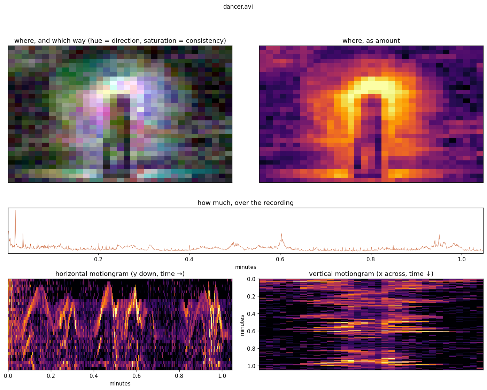
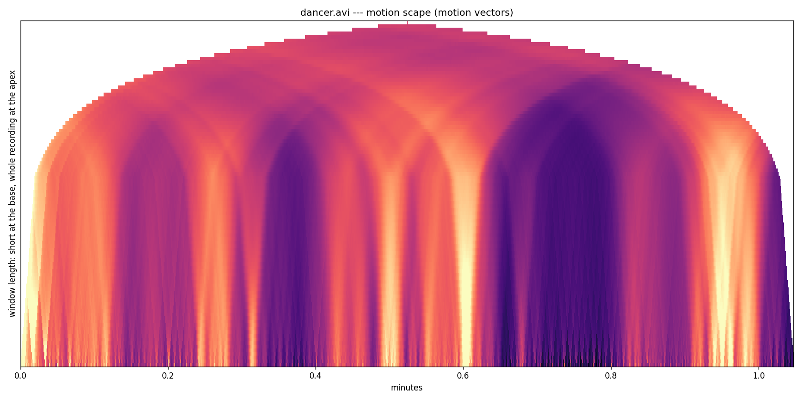

# Motion vectors

Every inter-frame codec has already searched for the displacement of each macroblock in
order to compress the video. These two functions read that work back out instead of doing
it again: `motionvectors()` draws it, `motionvectordata()` returns it as numbers.

## Drawing them

`motionvectors()` renders the vectors as arrows over the video, via ffmpeg's `codecview`
filter. It is a decoder-level view of motion with nothing recomputed, and it needs only
ffmpeg.

Only codecs that carry motion vectors will show anything. Intra-only formats—MJPEG,
common in `.avi` files—have none.

## Reading them as data

`motionvectordata()` returns one row per decoded frame: the time, the picture type, how
many vectors the frame carried, an area-weighted `magnitude`, and the typical displacement
`median_dx` / `median_dy` of the blocks that moved.

It is cheap in a way that differencing pixels is not. On a 103-minute recording, decoding
took 2.2 s and decoding *with* the vectors took 2.7 s, against 27 minutes to compute
frame-differenced quantity of motion over the same file.

**Filter by picture type.** This is the difference between a usable signal and a poor one.
Measured against exact quantity of motion on a 100-minute corpus:

| frames used | r |
|---|---|
| P-frames only | **0.87** |
| each type standardised, then pooled | 0.70 |
| everything pooled | 0.54 |

B-frames are about three quarters of the frames, and their vectors point both ways over
varying temporal distances, so they are not measuring the same quantity. Keeping only
`picture_type == 'P'` leaves roughly 12.6 Hz on 50 fps footage, which is ample for anything
at the scale of a gesture.

**It measures the encoder, not the scene.** An encoder may choose any vector that predicts
a block cheaply, so on flat or still regions the vectors mean little. Across 18 windows of
six recordings the correlation with quantity of motion had a median of 0.82—but 0.86 in
windows with movement in them, against 0.57 in windows without. A re-encoded proxy carries
its proxy encoder's decisions, not the camera's.

**`source` gives the direction of the reference, never the distance.** It is plus or minus
one even when the encoder predicted from four frames back, so multi-frame predictions read
as multiples of the true per-frame displacement. On a block moving 4 pixels per frame, 53
per cent of vectors came back as 4 and the rest as 8 or 16. The medians are robust to this;
`magnitude`, being a sum, is not, and is best treated as a quantity to correlate against
itself over time rather than as pixels per second.

## Looking at a lot of material quickly

`motionvectoroverview()` is the one to reach for first on unfamiliar video. It produces
**one sheet per recording from a single decode**, carrying the three kinds of
representation a first pass wants:

* **spatial**—the area motion covered, coloured by direction, and again as plain amount
* **temporal**—motion across the whole recording, the curve to scrub against
* **spatio-temporal**—horizontal and x-motiongrams, where a body crossing the
  room draws a diagonal

*The bundled `dancer.avi` on one sheet. The amount map draws the arc the arms swept
around a body that never moved its feet, and the motiongrams carry the same dance in
the classic orientations: the y-motiongram runs time rightward and holds the
arm oscillations, since this dance is vertical movement, and the x-motiongram
runs time downward with the room's width across.*

About five minutes for a 100-minute 1920x1080 recording, against roughly twenty-four for
the same views computed one at a time, because decoding is nearly the whole cost and each
separate view opens the file again. Every array is on the returned figure's `.data`, so the
same pass can feed further analysis without decoding twice.

In the direction panel, hue is the bearing, value is how much motion there was, and
**saturation is directional coherence**—how consistently that part of the room moved one
way. Grey means "moved, but not in any one direction", which is the honest description of
most of a room during improvisation. Coherence is under-sampled above about 1.5 Hz on 50 fps
footage, since P-frames arrive at roughly a quarter of the frame rate: right for a body
crossing a room, wrong for a shaking hand.

## Every timescale at once

`motionscape()` draws the quantity of motion at every timescale at once: a triangle
whose base row is the motion in short windows, each row above a longer window, and the
apex one window covering the whole recording. The construction comes from Craig Sapp's
keyscapes, which do the same for tonality.

*The bundled `dancer.avi`: bright columns at the base are single bursts, the dark mass
around 0.7--0.8 minutes is a stretch of stillness long enough to survive widening
windows, and the arches show where neighbouring episodes merge.*

It answers a question the flat curve cannot: at what scale does this recording stop
looking like one thing? Evenly continuous material is flat all the way up. A few busy
patches separated by quiet stay separate at the base and merge into one mass higher up, and
the height at which they merge is the length of the structure joining them.

It is a real triangle: each row is only as wide as the number of places a window that long
can sit, and the narrowing is the information rather than a cosmetic frame.

Nothing in it assumes motion vectors. Pass `track=` any per-frame series—`mg_motion`'s
`QomRaw`, or a `qom.f4` read off disk—to scape a frame-differenced quantity of motion
instead. Built from a cumulative sum, so the cost does not grow with window length.

## Reproducibility

Frame-threaded decoding drops motion vectors, and not the same ones twice. Three
identical runs over one clip returned 28,702, 29,649 and 29,975 vectors with threading on,
and 29,975 every time with it off.

On a real 1920x1080 recording the loss is 222 vectors in 25.7 million—0.0009 per cent,
far below anything that changes a reading—and threading is about 4.5 times faster, so it
is the default. Pass `deterministic=True` to anything in this module when a result has to
reproduce exactly.

## Which files this works on, measured

One 120 s window of real dancing, re-encoded every way, comparing the vectors against the
frame difference of that same file, and timing both.

**Codec decides whether it works at all.** ffmpeg exports motion vectors for H.264 and
MPEG-4 Part 2 and, in this build, nothing else—HEVC and VP9 decode perfectly and return
*zero* vectors, so the result is all zeros with no error. `motionvectordata` warns when a
file carries none, because zeros otherwise read as stillness.

| codec | r (P-frames) | vectors |
|---|---|---|
| H.264 | **0.82** | yes |
| MPEG-4 Part 2 | 0.72 | yes |
| HEVC |—| **none exported** |
| VP9 |—| **none exported** |
| MJPEG |—| none (intra-only) |

**Resolution barely matters, which is the useful part.** The vectors are computed on
macroblocks, so the cost scales with area but the agreement does not.

| width | r (P-frames) | vector cost | framediff cost | speed-up |
|---|---|---|---|---|
| 320 | 0.73 | 0.12 s | 1.11 s | 9× |
| 640 | 0.82 | 0.24 s | 2.21 s | 9× |
| 1280 | 0.80 | 0.88 s | 5.60 s | 6× |
| 1920 | 0.81 | 1.97 s | 11.57 s | 6× |

**Frame rate helps.** More P-frames means more of the signal, and at 50 fps the agreement
with the *source* recording's own motion is much the better for it.

| fps | r (P-frames) | r against the 1920 source |
|---|---|---|
| 12 | 0.72 | 0.50 |
| 25 | 0.82 | 0.45 |
| 50 | **0.89** | **0.72** |

**Compression quality hardly matters, and heavier compression is if anything better.**

| CRF | r (P-frames) |
|---|---|
| 18 | 0.75 |
| 23 | 0.82 |
| 30 | **0.84** |
| 38 | 0.81 |

At high quality the encoder subdivides finely and spends vectors on detail that is not
movement; at low quality it keeps large blocks that track the body. So a proxy is not a
handicap here, which is worth knowing given how often analysis runs on one.

Across the whole sweep the vectors ran 5 to 25 times faster than differencing the same
file, and pooled correlation stayed between 0.01 and 0.53 against 0.72--0.89 on P-frames
alone—the single most important thing to get right.

Reading the vectors needs PyAV—`pip install musicalgestures[motionvectors]`. ffprobe
will say the side data is present but will not print it, and ffmpeg has no numeric dump, so
there is no command-line route. Drawing them is unaffected.

::: musicalgestures._motionvectors
