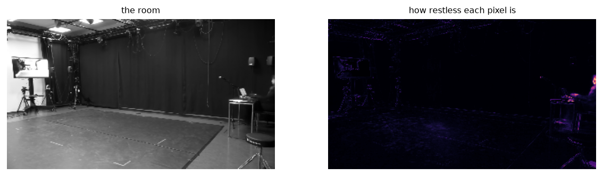

# Room and occupancy

The empty room, how much of the frame anybody fills, and which pixels change whatever is in
front of them.



Left: the room recovered as a per-pixel median over sampled frames. Median and not mean,
because a mean keeps a faint ghost of everyone who crossed, and subtracting a ghost leaves
holes shaped like people.

Right: how restless each pixel is. The bright region here is not the video-call screen on the
left of the room but a table on the right, with a laptop and a seated researcher—in
shot for the whole recording, and counted by quantity of motion like anybody else. On this
corpus that non-dancer motion was 2.8 to 7.1 per cent of the total.

Occupancy answers what motion cannot: somebody standing still has no motion and plenty of
occupancy.

## The frames the plate is built from must be spread over the recording

The median is taken twice: once over a blind sample, then again over the emptiest of
those frames, since a median over a blind sample keeps whoever stood still for most of it.

The catch is that the emptiest frames are not spread through a recording. They cluster in
whatever stretch nobody was working—a break, a setup, a pack-down—and anything
standing in the room during that stretch enters the plate as though it were furniture.

On one recording here a stepladder stood in the middle of the floor for about ten
minutes of a two-hour session. Those frames were the emptiest by a wide margin, all of the
refinement's frames came from them, and the ladder became part of "the room". Every
occupancy figure afterwards then read that region as occupied 18.6 per cent of the time
--- as though a body were standing there—because the plate expected a ladder that was
usually absent.

So the second pass takes the emptiest frame from each of `k` equal stretches rather than the
emptiest `k` overall. The choice is still made on emptiness; it simply cannot all come from
one place. `stratify=False` restores the older behaviour, and `plate_spread` reports how
much of the recording the chosen frames span—`room_plate` warns below half.

```python
plate, used = mg.room_plate("session.mp4")
mg.plate_spread(used, n_frames)      # near 1 is spread, near 0 is one stretch
```

::: musicalgestures._plate
