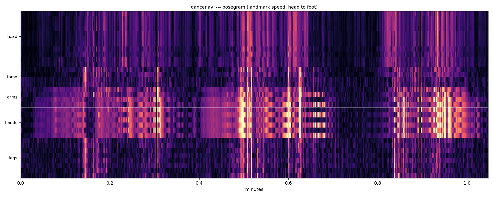

# Posegram

Which part of the body moved, and when—and the same question asked on the image's own
axes so it can be laid beside a motiongram.

*The bundled `dancer.avi`: one row per landmark, head to foot, coloured by that
landmark's speed. The dance lives in the arm and hand rows; the legs stay dark.*

`pose_waterfall` and the trajectory renders say *where* the body went, `pose_segments` how
its limbs were angled, `pose_center` how its centre moved. None of them answers what a
motiongram answers for pixels: what was moving at 04:12. That is usually the question
an annotator has.

## Two views, two frames of reference

`posegram()` puts one landmark per row, ordered head to foot with left and right
adjacent. That ordering is the design, not decoration: MediaPipe emits its 33 landmarks in
model order, which scatters the body—nose, eyes, ears, mouth, then shoulders, elbows,
wrists, then eight hand points, then hips, knees, ankles, feet. Plotted that way an arm is
four rows in three places and the picture says nothing. Ordered anatomically a moving limb
is a contiguous band, and the axis reads *head / arms / hands / torso / legs*.

`posegram_spatial()` puts image position on the vertical axis instead, which is what a
x-motiongram does. A body crossing the frame draws the same diagonal in both, so the
two can be read against each other—and where they disagree, either the pixels saw
something the pose model missed or the model invented something the pixels do not support.

`weight='speed'` is the motiongram's own quantity and the comparable one. `weight='presence'`
brightens by where the body *is* regardless of motion, which is a different question: a
dancer standing still has presence and no speed.

## Things that will bite

**Pass `frame_size` whenever you pass `landmarks`.** MediaPipe estimates landmarks it
cannot see and places them outside the picture—on a real 640×360 extraction the
largest y was 1529, four times the frame height. Inferring the frame from the data
therefore scales the plot by an extrapolation, and squeezes the entire body into the top
quarter while the rest goes black. Without `frame_size` a high percentile is used, which is
robust but still a guess.

**Undetected frames are all-NaN**, and differencing across one would invent a large
displacement going in and another coming out—two spikes bracketing a gap where nothing
happened. Those differences are dropped rather than filled, so an undetected stretch reads
as no motion.

**Pose is one person.** MediaPipe Pose returns a single figure, so on footage with two
people it follows whichever it locked onto and does not say which.

::: musicalgestures._posegram
