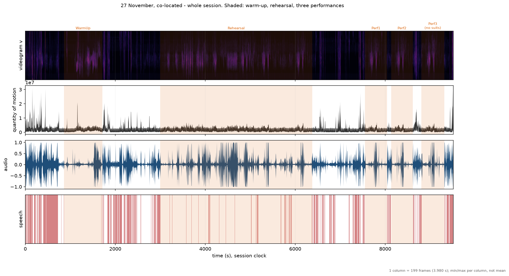

# Timeline

Sheets: videogram, motion, sound and segmentation on a shared time axis.

`shade=` draws a span's **extent** rather than the line where it began. A line lets a reader
assume a section ran until the next line; on the corpus this was built for that is wrong by
21 minutes, because the warm-up ends and nothing happens for a third of an hour before the
rehearsal starts.

Every sheet prints its own decimation factor, so a rendering artefact is never mistaken for
data, and writes a JSON sidecar recording every boundary drawn.

::: musicalgestures._timeline
