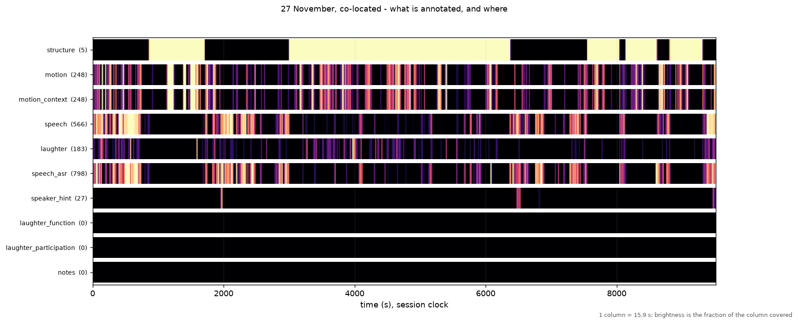
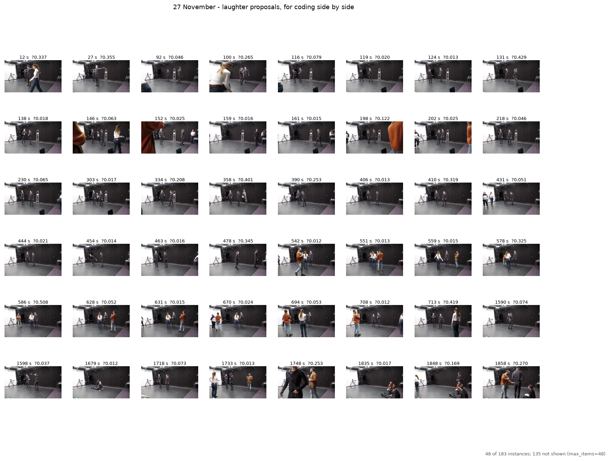
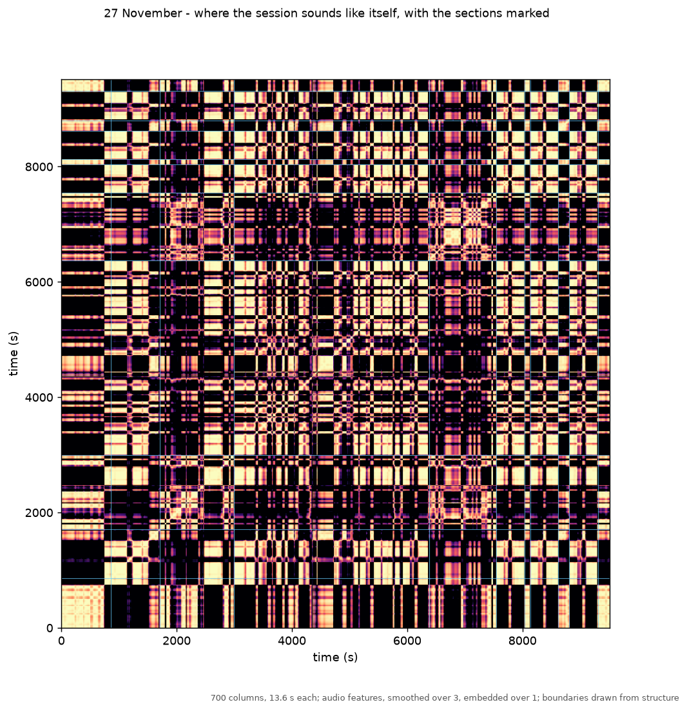

# Annotation views

Figures that know about annotations: filmstrip, concordance, tier map, structure map.

Every other way this toolbox has of looking at a long recording is about the signal.
`Hierarchy` and the ELAN exporter sit on the other side of a gap almost nothing crosses, and
for somebody annotating hours of video that crossing is the tool.

## `tier_map`—where is there anything to look at

Every tier as a density band across the recording. Brightness is the fraction of each column
covered. Empty tiers are drawn as empty bands rather than omitted, because noticing what
has *not* been annotated is half of what the view is for.

## `concordance`—every instance of one category, side by side

The linguist's concordance applied to video. Coding 183 proposals one at a time, hours apart,
is how a category drifts; seeing them together is how it does not. What the cap left out is
stated on the figure, never silently.

## `filmstrip`—what is actually happening here

Keyframes on the time axis with the annotation tiers beneath them, pinned to the same
x-limits so a frame is never drawn above a span it does not belong to.

## `structure_map`—where a recording repeats itself

A self-similarity matrix with somebody's coding drawn on it. Read its warning before using
it: its defaults are measured, not assumed, and video features failed on the corpus it was
written for.

::: musicalgestures._views
