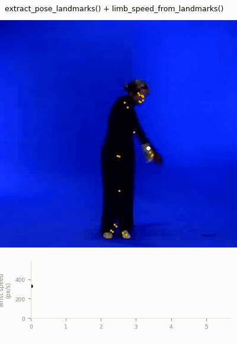

# Pose Tracking

MGT-python's pose story spans two complementary layers:

- **`MgVideo.pose()`** — the rendering-oriented pipeline: overlaid skeleton video, an
  average-pose image, a marker-trajectories image, and a keypoint data file (CSV/TSV/TXT/C3D).
  See the [Video Analysis](video-analysis.md#pose-estimation) page for the full method reference,
  including `pose_waterfall()`, `pose_segments()`, `pose_center()` and `pose_distance()`.
- **The array-level pose toolkit** (`_posetools`, `_qom`, `_mocap`) — plain numpy trajectories and
  derived motion signals for batch processing, event detection, and cross-modality validation, with
  no video rendering involved.

This page walks through both, end to end: installing the optional dependency, rendering a pose
video, extracting landmark trajectories in bulk, computing derived signals (speed, impacts,
quantity of motion), and validating a video-derived pose signal against motion-capture ground
truth.

---

## Installing the `[pose]` extra

The default pose backend (MediaPipe) is an optional dependency:

```bash
pip install musicalgestures[pose]
```

This pulls in `mediapipe>=0.10`. Without it, `MgVideo.pose()` still works — it falls back to the
always-available OpenPose `body_25` backend (Caffe weights, ~200 MB, auto-downloaded on first
use) — but the array-level `extract_pose_landmarks()` requires MediaPipe and raises `ImportError`
if it's missing.

!!! note "MediaPipe has two API families — both are supported"
    MediaPipe's Python API changed generations mid-stream:

    - The legacy **Solutions API** (`mp.solutions.pose.Pose`) — present in wheels up to roughly
      `mediapipe==0.10.14`.
    - The newer **Tasks API** (`PoseLandmarker`, `mp.tasks.vision`) — the only option in newer
      `0.10.x` wheels (e.g. `0.10.35`), which dropped `mp.solutions` entirely.

    `extract_pose_landmarks()` detects which family is available at runtime
    (`hasattr(mp, "solutions")`) and uses whichever is present, so it works across the whole
    `mediapipe>=0.10` range without pinning a version. `MgVideo.pose(model='mediapipe')` and the
    per-frame `MediaPipePoseEstimator` always use the Tasks API.

    With the Tasks API, the pose-landmarker model is a `.task` file (~8–28 MB depending on
    `model_complexity`: lite/full/heavy) downloaded from Google's model storage on first use and
    cached in `musicalgestures/models/`, shared by `MgVideo.pose()` and `extract_pose_landmarks()`
    alike. Subsequent calls reuse the cached file — no repeat download.

---

## Rendering with `MgVideo.pose()`

`pose()` runs skeleton estimation frame by frame and renders an overlaid video plus summary
images:

```python
import musicalgestures as mg

mv = mg.MgVideo('dance.avi')

pose_video = mv.pose()                 # MediaPipe by default, GPU delegate if available
pose_video.show()

# style / appearance
mv.pose(style='markers', overlay=False)          # keypoints only, no video underneath
mv.pose(style='skeleton')                        # joint lines only
mv.pose(overlay=False, background='white')       # print-friendly, black skeleton on white
mv.pose(marker_history=10)                        # fading motion trail per marker

# data export
mv.pose(data_format=['csv', 'c3d'])               # also write a .c3d mocap file
```

Key parameters (see the [full signature](video-analysis.md#pose-estimation) for everything):

- `model` — `'mediapipe'` (default, 33 landmarks with depth + visibility) or an OpenPose variant
  (`'body_25'`, `'coco'`, `'mpi'`).
- `device` — `'cpu'` or `'gpu'`. For MediaPipe this selects the inference delegate (GPU falls back
  to CPU automatically if unavailable). For OpenPose, GPU needs a CUDA-enabled OpenCV build.
- `threshold` — normalized confidence below which a keypoint is discarded (substituted with
  `(0, 0)`). Defaults to `0.1`.
- `use_cache` — when `True` (default), a second `pose()` call with the same `model`/`threshold`
  reuses the already-computed keypoints to re-render a different `style`/`overlay`/`background`
  without re-running inference:

```python
mv.pose(style='markers')      # runs inference, caches keypoints
mv.pose(style='skeleton')     # reuses cache — near-instant, no re-inference
```

- `save_average_pose` / `save_trajectories` — also render an average-pose image (markers coloured
  by normalised quantity of motion, labelled with dominant frequency) and a marker-trajectories
  image, each with a companion stats CSV. Both default to `True`.

If MediaPipe isn't installed and `model='mediapipe'` (the default) is requested, `pose()` prints a
notice and transparently falls back to the OpenPose `body_25` backend.

---

## Batch landmark-trajectory extraction with `extract_pose_landmarks`

For downstream numeric analysis (quantity of motion, event detection, cross-modal alignment)
rather than a rendered video, use the array-level `extract_pose_landmarks()`. It decodes the
video through an FFmpeg raw-video pipe (optionally resampled/resized first), runs MediaPipe Pose
per frame, and returns tidy numpy trajectories — no OpenCV frame-accurate conversion, no video
output.

```python
from musicalgestures import extract_pose_landmarks

traj = extract_pose_landmarks(
    'strike.mp4',
    fps=30,               # resample to 30 fps before inference (None = native)
    width=640,             # resize analysis frames to 640 px wide (None = native)
    model_complexity=1,    # 0=lite, 1=full, 2=heavy
    world_landmarks=False, # set True to also collect 3D world landmarks (metres)
    target_name='strike_pose.csv',   # optional: also write a tidy CSV
)

traj['landmarks']        # (F, 33, 3) — per-frame (x_px, y_px, visibility)
traj['detected']         # (F,) bool — per-frame detection flag
traj['detection_rate']   # fraction of frames with a detected pose
traj['fps'], traj['width'], traj['height']
traj['names']            # the 33 MediaPipe landmark names, row order of the landmark axis
```



**NaN/dropout semantics:** on any frame where MediaPipe doesn't detect a pose, the corresponding
row of `traj['landmarks']` (and `traj['world']`, if requested) is filled with `NaN` across all 33
landmarks and 3 channels, rather than zeros or a dropped row — every frame index still has a
timestamp in `traj['time']`, so downstream signals stay aligned in time even across dropouts. The
derived-signal helpers below are NaN-aware and propagate these gaps rather than silently treating
them as valid zero-motion samples.

**Detection-rate reporting:** with `verbose=True` (the default), each call prints a one-line
summary, e.g.:

```
strike.mp4: 900 frames at 30 fps (640x360), pose detected in 97% of frames.
```

`traj['detection_rate']` carries the same number for programmatic use (e.g. flagging low-quality
takes before running further analysis).

Only `extract_pose_landmarks()` needs MediaPipe; it's imported lazily, so importing
`musicalgestures` and using the numpy-only derived-signal helpers below works even without
MediaPipe installed.

---

## Derived signals

Once you have landmark trajectories — from `extract_pose_landmarks()`, `MgVideo.pose()`'s saved
CSV, or any other source (OpenPose, YOLO-pose, motion capture) — a small set of numpy-only
functions turn them into motion signals and events.

### `midpoint` — a proxy point between two landmarks

```python
from musicalgestures import midpoint

shoulders = midpoint(traj['landmarks'][:, 11, :2], traj['landmarks'][:, 12, :2])  # (F, 2)
```

Element-wise midpoint of two trajectories (typically the shoulder midpoint, landmarks 11/12, as
an upper-torso proxy). NaNs propagate: the midpoint is NaN wherever either input is NaN.

### `limb_speed_from_landmarks` — confidence-gated speed, with a timing caveat

```python
from musicalgestures import limb_speed_from_landmarks

wrists = traj['landmarks'][:, [15, 16], :2]   # left/right wrist, px
conf = traj['landmarks'][:, [15, 16], 2]      # MediaPipe visibility

speed = limb_speed_from_landmarks(wrists, conf, traj['fps'], conf_gate=0.5, merge='max_lr')
# speed: (F,) px/s — bilateral max of left/right wrist speed, lightly smoothed
```

Frames whose landmark confidence falls below `conf_gate` are masked to NaN before
differentiation; the per-limb speed is the central-difference magnitude of the pixel path (px/s);
candidate limbs (e.g. left/right wrist) are merged by element-wise maximum (`merge='max_lr'`) so
motion of *either* limb registers; the result is then lightly smoothed with a short NaN-aware
moving average (`smooth_taps=3` by default).

!!! warning "Speed precedes contact"
    A limb-speed peak marks the moment of **maximum downstroke speed**, not the moment of
    contact/arrest. Physically, a striking limb decelerates sharply *at* impact, so the speed
    peak — and any peak-picker run on this signal — systematically occurs slightly **before** the
    actual contact event that an audio onset or an acceleration peak would register. Account for
    this bias when comparing event times derived from `limb_speed_from_landmarks()` against other
    modalities (audio onsets, `impact_events()` on acceleration, motion capture). This is also a
    single-camera 2D signal: motion toward/away from the lens is foreshortened, so pixel speed is
    not metric speed.

Peak-picking on the returned signal is left to the caller — MGT-python's general adaptive
peak-picker `pick_peaks` (`_peaks` module, see the
[Sound–Movement Analysis Toolkit](sound-movement-toolkit.md#peak-picking-core) page) is a good
default.

### `impact_events` — candidate impacts from acceleration peaks

```python
from musicalgestures import impact_events

impacts = impact_events(wrists, traj['fps'], rel_thresh=0.12, min_interval_s=0.10)
impacts['time']        # impact times (s)
impacts['magnitude']   # merged acceleration magnitude at each impact
impacts['accel']       # the full merged acceleration-magnitude signal, for plotting
```

Each candidate point (e.g. the two wrist landmarks) is double-differentiated (central
differences) to acceleration, merged by element-wise maximum across points, and peak-picked with
a relative threshold (`rel_thresh` × the signal's max) and a minimum inter-impact interval
(`min_interval_s`). Because double-differentiation is noisy and also responds to the backswing —
not only the collision — treat the results as *candidate* impacts and validate against another
modality (e.g. audio onsets, or the mocap comparison workflow below) where possible. For
whole-image visual impact detection from video with no landmarks at all, use `MgVideo.impacts()`
instead.

### `pose_qom` / `body_scale` — quantity of motion, normalised for framing

```python
from musicalgestures import pose_qom, body_scale, normalized_qom

qom, speed, fs_out = pose_qom(traj['landmarks'][..., :2], traj['fps'])
# qom: scalar mean speed (px/s), band-limited to 0.3-5 Hz (landmark jitter dominates above that)
# speed: the per-frame envelope, at fs_out Hz

scale = body_scale(traj['landmarks'][..., :2])   # median torso length (shoulders->hips), px

# or in one call, dividing qom/speed by body_scale automatically:
qom_norm, speed_norm, fs_out = normalized_qom(traj['landmarks'][..., :2], traj['fps'])
print(f"{qom_norm:.3f} body-lengths/s")   # dimensionless -- comparable across framing/zoom
```

`pose_qom()` is a thin wrapper around the general `group_qom()` (any group of marker/landmark
trajectories, mocap included), band-limited to 0.3–5 Hz for image-space pose data.
`body_scale()` computes the median torso length — the distance between the shoulder midpoint
(landmarks 11/12 by default) and the hip midpoint (23/24) — preferred over shoulder width because
it stays robust in profile view. `normalized_qom()` divides the pose QoM by `body_scale()`,
producing a dimensionless body-lengths-per-second figure that's invariant to camera framing and
zoom, so it's comparable across recordings and cameras (used in the Westney study's
with/without-audience piano comparison).

---

## Validating video-derived pose against motion capture

For quality assurance — or when both a video and a synchronised motion-capture recording exist —
`_mocap` provides a reader for Qualisys Track Manager (QTM) exports and a correlation check
against any other motion envelope, e.g. one derived from `extract_pose_landmarks()`.

```python
from musicalgestures import (
    extract_pose_landmarks, pose_qom,
    read_qtm_tsv, group_qom, compare_modality_envelopes,
)

# 1. Video-derived pose envelope
traj = extract_pose_landmarks('take01.mp4', fps=30, width=640)
wrist = traj['landmarks'][:, 16, :2]                      # right wrist, px
qom_video, speed_video, fs_video = pose_qom(wrist, traj['fps'])

# 2. Motion-capture envelope, same body part
marker_names, mocap_data, fs_mocap = read_qtm_tsv('take01.tsv')
i = marker_names.index('RWrist')
speed_mocap, fs_mocap_out = group_qom(mocap_data[:, [i], :], fs_mocap)[1:]

# 3. Compare the two envelopes
result = compare_modality_envelopes(speed_video, speed_mocap, fs_video, fs_mocap_out)
print(f"video vs. mocap agreement: r={result['r']:.2f} over {result['n']} s")
```

`read_qtm_tsv(path)` returns `(marker_names, data, fs)`: `data` has shape `(T, M, 3)`, with
Qualisys's exact-zero gap fills converted to `NaN`, marker names recovered from the
`MARKER_NAMES` header row, and a UTF-8 → latin-1 encoding fallback. `compare_modality_envelopes`
deliberately takes *precomputed* 1-D envelopes rather than computing quantity-of-motion itself —
resampling both to a common one-sample-per-second grid, then returning their Pearson correlation
(`r`) and the number of overlapping seconds (`n`); `r` is `NaN` if fewer than three seconds
overlap or either envelope is constant. Because the per-second binning uses an integer-rounded
step, non-integer frame rates (e.g. 29.97 fps) drift slightly over long signals — treat this as a
validation check, not a precise-alignment tool.

---

## Next steps

- [Video Analysis](video-analysis.md#pose-estimation) — full `MgVideo.pose()` reference, plus
  `pose_waterfall()`, `pose_segments()`, `pose_center()`, `pose_distance()`
- [Sound–Movement Analysis Toolkit](sound-movement-toolkit.md) — the wider array-level toolkit
  (`_qom`, `_peaks`, `_alignment`, `_posture`, ...) that the derived-signal functions here belong to
- [API Reference](../musicalgestures/index.md) — complete function signatures
