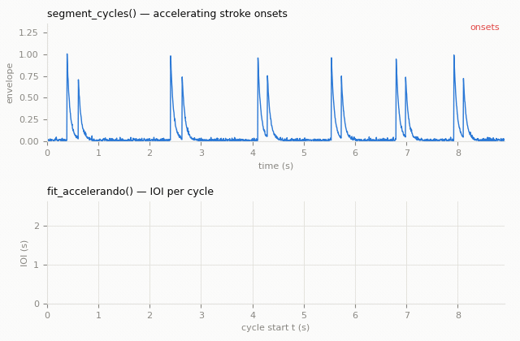
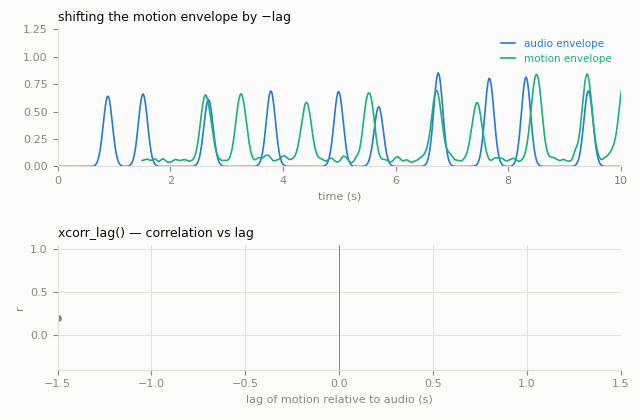
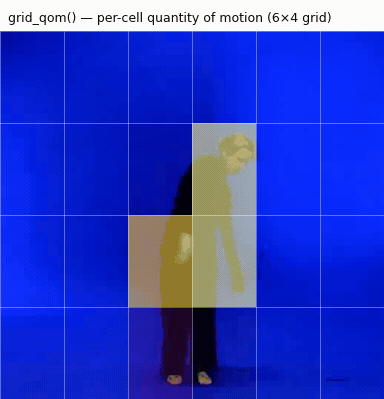
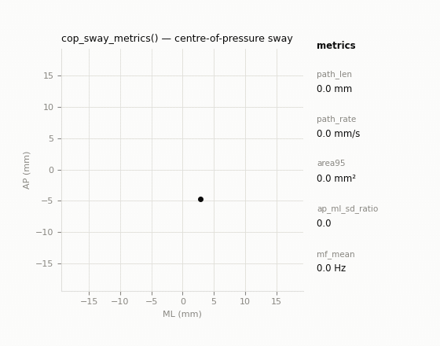
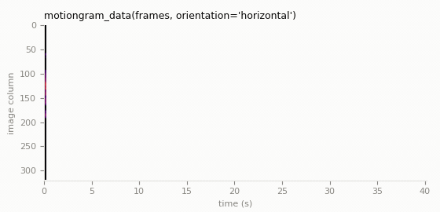

# Sound–Movement Analysis Toolkit

Alongside the `MgVideo`/`MgAudio` methods, MGT-python ships a lower-level toolkit of
plain-numpy sound–movement analysis functions, ported from the author's own research
pipelines: the **ro** ritual-drumming study, the **stillstanding**/standstill-championship
posturography study, the **Westney** with/without-audience piano comparisons, and the
**cymbal**-comparison striking study. Unlike the `MgVideo`/`MgAudio` methods, these functions
operate directly on numpy arrays (onset times, position/landmark trajectories, waveforms)—no
 video decoding or rendering—so they drop straight into notebooks, batch scripts, or your
own analysis pipeline. Every function is importable directly from `musicalgestures` (except
where noted) and documents its own provenance and default-parameter caveats in its docstring;
see the [API Reference](../musicalgestures/index.md) for full signatures.

---

## Peak-picking core

`pick_peaks(x, fs=1.0, smooth=3, rel_threshold=0.5, min_interval=0.3, rel_prominence=0.2, ...)`
(`_peaks`) is the single adaptive peak-picker—moving-average smoothing, a relative or
absolute amplitude threshold, a minimum inter-peak interval, and an optional prominence gate—shared
 by every event detector in the toolkit (`_pulse`, `_alignment`, `_qom`,
`_audiofeatures`). Its docstring records the provisional per-signal-type defaults used across
the source studies (e.g. hand-acceleration impacts vs. audio energy onsets vs. wrist-speed
peaks); tune the parameters to the signal at hand rather than relying on the defaults.

---

## Pulse and cycle segmentation (`_pulse`)

Tools for accelerating rhythmic sequences (developed for the *ro* ritual's accelerating
double-drum-stroke cycles): group onsets into per-cycle stroke groups, tabulate per-cycle
metrics, and fit an exponential accelerando.

```python
import numpy as np
from musicalgestures import segment_cycles, cycle_table, fit_accelerando, motion_onsets

onsets = np.array([0.10, 0.34, 1.02, 1.24, 1.85, 2.02, 2.55, 2.68])   # seconds
cycles = segment_cycles(onsets)                    # list[Cycle]: DP segmentation over stroke gaps
table = cycle_table(cycles, clip_id='ro_2023')      # per-cycle DataFrame (t, ioi, n_strokes, ...)
ioi0, t_double, r2 = fit_accelerando(table['t'], table['ioi'])
print(f"tempo doubles every {t_double:.1f}s (R²={r2:.2f})")

# Steepest sustained rises of a motion signal (e.g. per-frame QoM), for
# correlating movement onsets with the stroke cycles above:
motion_times = motion_onsets(qom_signal, fs=25.0)
```



`group_strokes()` (used internally by `segment_cycles`) segments onsets by dynamic programming
over candidate group boundaries, encoding structural priors for accelerating cyclic patterns
(group-size cost, within-group gap plausibility, ordering, and a non-increasing-gap
accelerando prior). `Cycle` is a small dataclass (`index`, `strokes`, `event`,
plus `t_start`/`n_strokes`/`stroke_gap` properties).

---

## Cross-modal alignment (`_alignment`)

Lead/lag and coupling between two (or more) time-aligned signals, the audio-vs-movement
counterpart of the `_pulse` module.

- `xcorr_lag(x, y, fs, max_lag=1.5)` / `envelope_lag(...)` — cross-correlation lead/lag between
  two envelopes.
- `per_cycle_motion_delta(...)` — per-cycle timing offset between a stroke cycle and a motion
  onset.
- `anchor_and_match(...)` / `offset_stats(...)` — one-to-one event matching against an anchor
  stream, with offset summary statistics.
- `sliding_correlation(...)` — windowed correlation over time (does coupling drift?).
- `envelope_agreement(...)` — N-source envelope agreement score.

```python
from musicalgestures import xcorr_lag

lag, corr = xcorr_lag(audio_envelope, motion_envelope, fs=25.0, max_lag=1.5)
print(f"movement lags audio by {lag:.3f}s (r={corr:.2f})")
```



---

## Quantity-of-motion cores (`_qom`)

Band-limited QoM (with an automatic decimate+SOS regime for very low frequency bands),
accelerometer-to-speed integration, per-landmark-group pose QoM, body-scale normalization for
framing-invariant comparisons, spatial grid QoM, and small envelope/binning helpers.

```python
from musicalgestures import band_limited_qom, accel_to_speed

speed, fs_out = band_limited_qom(marker_xyz, fs=100.0, lo=0.3, hi=15.0)   # px or mm per second
```



`group_qom()` generalises `band_limited_qom()` to any group of marker/landmark trajectories
(mocap markers included), and `accel_to_speed()` integrates a 3-axis accelerometer to a speed
signal (the "corpus method" from the stillstanding study). For the pose-specific
`pose_qom()`/`body_scale()`/`normalized_qom()` (framing-invariant QoM from MediaPipe landmarks),
see the dedicated [Pose Tracking](pose-tracking.md#derived-signals) page.

---

## Audio feature extraction (`_audiofeatures`)

Scipy-only audio features and onset detectors that complement the librosa-based, figure-producing
`MgAudio` methods with lightweight numeric outputs: `rms_envelope`, `spectral_flux`,
`spectral_flux_onsets`, `energy_onsets`, `t60_backward_decay` (reverberation time), and
`attack_spectral_centroid`. All onset detectors use `pick_peaks` under the hood.

```python
from musicalgestures import rms_envelope, energy_onsets

env, rate = rms_envelope(y, sr, window=0.02)
onsets = energy_onsets(y, sr)     # onset times (s) from the RMS envelope
```

---

## Postural sway metrics (`_posture`)

Posturography ported from the stillstanding study, operating on plain centre-of-pressure (CoP)
or marker-position arrays, with no study-specific loaders or axis conventions:

- **Sway amount / geometry** — `cop_sway_metrics`, `confidence_ellipse_area`, `convex_hull_area`.
- **Control dynamics / complexity** — `stabilogram_diffusion` (Collins–De Luca SDA), `dfa`
  (detrended fluctuation analysis), `sample_entropy`, `spectral_edges`, `sway_texture`,
  `principal_axis_projection`.
- **Direction / extent** — `sway_orientation`, `axial_rayleigh`, `spatial_extent`.

```python
from musicalgestures import cop_sway_metrics

metrics = cop_sway_metrics(cop_xy, fs=100.0)   # cop_xy: (T, 2) array [ML, AP], mm
print(metrics['path_len'], metrics['area95'], metrics['ap_ml_sd_ratio'])
```



`cop_sway_metrics()` returns CoP path length/rate, the 95% confidence-ellipse area,
medio-lateral (ML) and antero-posterior (AP) ranges/standard deviations and their ratios, and
the mean sway frequency per axis. The from-scratch SDA/DFA/sample-entropy implementations are
validated in the test suite against known-answer synthetic signals.

---

## Physiology features (`_physio`)

`respiration_rate(waveform, fs, band=(0.1, 0.6), window_s=30, step_s=30)` — windowed breathing
rate (breaths/min) via band-pass filtering and a per-window Welch spectral peak, and
`spectral_band_fractions(...)` — the fraction of a signal's Welch power in each of a set of
caller-supplied named frequency bands (a generic spectral-composition diagnostic, e.g. for
cardiorespiratory QoM), both ported from the stillstanding study's Deichman/Equivital
physiology analyses.

---

## Motion-capture I/O and cross-modality comparison (`_mocap`)

`read_qtm_tsv(path)` is a single robust reader for Qualisys Track Manager (QTM) TSV exports,
consolidating several near-duplicate study loaders (marker-name recovery, numeric-block
autodetection, gap-fill-to-NaN conversion, UTF-8/latin-1 fallback).
`compare_modality_envelopes(...)` resamples two motion envelopes (e.g. video-pose vs. mocap) onto
a common per-second grid and correlates them.

!!! note "`dominant_frequency` is not re-exported from `_mocap`"
    `_mocap` also defines its own `dominant_frequency` (a Welch-peak variant from the Westney
    study). It is intentionally **not** re-exported at the `musicalgestures` top level, since it
    would shadow the pre-existing `musicalgestures.dominant_frequency` (from `_analysis`). Reach
    it explicitly as `musicalgestures._mocap.dominant_frequency`.

---

## Pose-landmark trajectory extraction (`_posetools`)

The *array-level* pose workflow: video file → tidy per-landmark trajectory arrays (and
optionally CSV) → derived motion signals (limb speed, impact events), complementing—not
replacing—the rendering-oriented `MgVideo.pose()` pipeline. This is covered in full on its own
page: **[Pose Tracking](pose-tracking.md)**, which covers installing the `[pose]` extra,
`extract_pose_landmarks()` (NaN/dropout semantics, detection-rate reporting), the derived-signal
helpers `midpoint()`, `limb_speed_from_landmarks()`, `impact_events()`, `pose_qom()`/
`body_scale()`, and validating a video-derived pose signal against motion capture with
`read_qtm_tsv()`/`compare_modality_envelopes()`.

---

## Numpy-level motiongram data

`motiongram_data(frames, orientation='vertical', frame_diff=True, normalize=True)` (in
`_motionanalysis`) computes a motiongram as a plain numpy array from a stack of grayscale
frames, with a selectable `orientation`: `'vertical'` collapses each frame to its per-row mean
(image row vs. time, e.g. a mallet's approach-and-rebound path), `'horizontal'` to its
per-column mean (image column vs. time, side-to-side motion). It is the numpy-level counterpart
of `MgVideo.motiongrams()`'s rendered `_mgv`/`_mgh` images. Use it when you want the motiongram
as data for further analysis, e.g. feeding it to `grid_qom()` or a peak-picker.



---

## Next steps

- [Audio-Video Analysis](audio-video.md)—the `MgVideo`-method-level audio–movement comparisons
  (`tempo_similarity`, `phase_synchrony`, `body_audio_coupling`, ...)
- [Pose Tracking](pose-tracking.md)—the full pose story: `MgVideo.pose()` rendering,
  `extract_pose_landmarks()`, derived signals, and motion-capture validation
- [API Reference](../musicalgestures/index.md)—full signatures for every function above
- [Examples](../examples.md)—a runnable pulse-segmentation example
