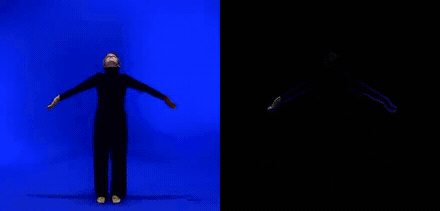
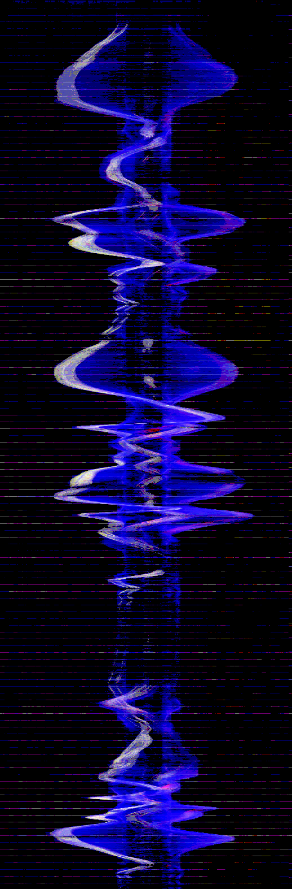
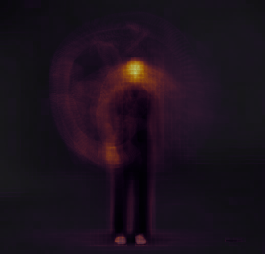
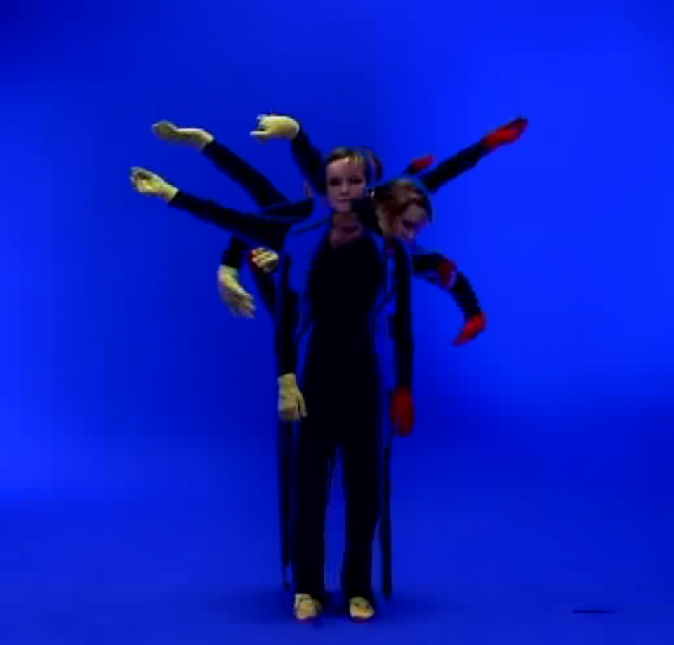
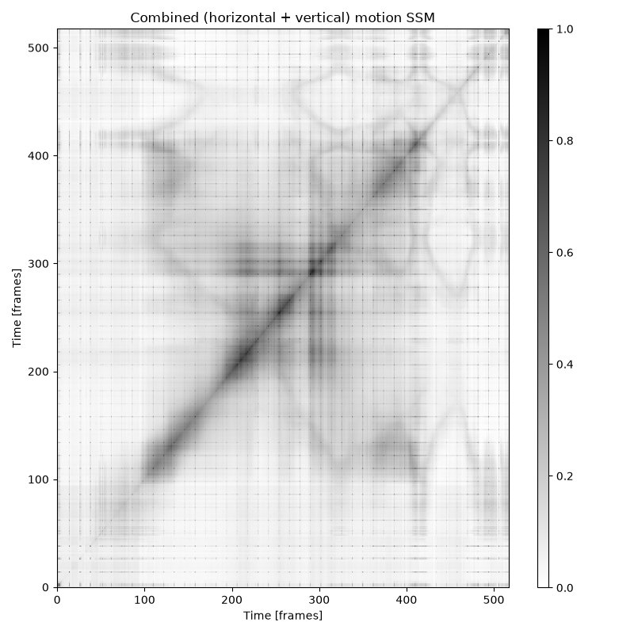
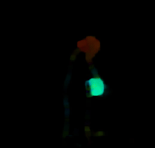
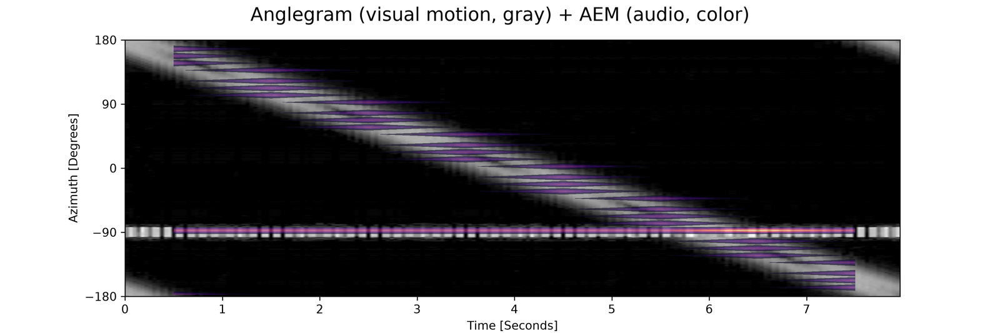

# Video Analysis

All video analysis methods are called on an `MgVideo` object. Each method writes output files alongside the source video and returns a result object you can use directly or pass to further methods.

```python
import musicalgestures as mg

mv = mg.MgVideo('/path/to/video.avi')
```

This page is a task reference: one snippet per method, with returns and gotchas. The course lives on the wiki and reads in order: [chapter 4](https://github.com/fourMs/MGT-python/wiki/4-%E2%80%90-Video%E2%80%90based-Processes) walks through the video-based processes, [chapter 5](https://github.com/fourMs/MGT-python/wiki/5-%E2%80%90-The-Effects-of-Filtering) shows in pictures what the threshold keeps and discards, and [chapter 15](https://github.com/fourMs/MGT-python/wiki/15-%E2%80%90-360-Video-Anglegrams-and-AEM) covers 360 video.

## Choosing a method

Several methods have overlapping or similar-sounding names. This table disambiguates the most commonly confused pairs, one line each:

| Method | Use it when you want… |
|---|---|
| `average()` | a long-exposure mean of all frames—it is a convenience alias for `blend(component_mode='average')`. |
| `blend()` | to composite all frames with a chosen mode (`'average'`, `'lighten'`, `'darken'`, …). |
| `history()` | a **video** where each frame carries a trail of overlaid past frames. |
| `motionhistory()` | a single **Motion History Image**—one image where brightness encodes *when* motion last happened (recency; order-dependent). |
| `motion().average()` / `heatmap()` | a single motion-**density** image—*where and how much* motion happened (order-independent). |
| `motiongrams()` | how **motion** (frame differences) is distributed in space over time. |
| `videograms()` | how the **raw pixel intensity** (the whole scene, not motion) is distributed in space over time. |
| `ssm()` on `MgVideo` | self-similarity from **visual** features (`features='motiongrams'`/`'videograms'`). |
| `ssm()` on `MgAudio` | self-similarity from **audio** features (`features='spectrogram'`/`'chromagram'`/`'tempogram'`). |
| `pose_waterfall()` | pose **markers** flowing through `(x, time, y)` space (needs pose data). |
| `silhouette_waterfall()` | the **silhouette** profile cascading over a time axis (no pose needed). |
| `motiontempo()` | the dominant **movement** tempo (from the quantity-of-motion signal). |
| `motiondescriptors()` | scalar summaries of *how* something moves: motion energy, smoothness (SPARC), entropy, and spectral descriptors. |
| audio `tempo()` / `tempogram()` | the **audio** tempo / rhythmic periodicity. |
| `tempo_similarity()` | to **compare** movement tempo against audio tempo. |

## AVI conversion (`convert`)

Most methods stream frames through FFmpeg and run on any container, MP4 included. The OpenCV-decoded methods—`flow.dense()`/`flow.sparse()`, `directograms()`, `impacts()`, `history_cv2()`—first convert the input to an all-intra MJPEG `.avi` (cached as `self.as_avi`) for frame-accurate decoding; pass `convert=False` to skip that when your MP4 decodes reliably. `pose()` defaults to `convert=None` (auto): MediaPipe reads the source directly, the OpenPose backends convert. Outputs keep the source container.

```python
mv = mg.MgVideo('clip.mp4')
mv.flow.dense(convert=False)
```

## Threshold and filter parameters

Many methods accept `threshold` and `filtertype`:

- `threshold` (float, 0–1): pixels with a change below this fraction of 255 are set to zero. The default is `0.05`. Higher values remove more background noise but may lose subtle motion.
- `filtertype` (str): `'Regular'` (default) thresholds and median-filters; `'Binary'` binarises the output; `'Blob'` applies erosion instead.

Worked visual examples are in [chapter 5 of the wiki](https://github.com/fourMs/MGT-python/wiki/5-%E2%80%90-The-Effects-of-Filtering); exact semantics in the [filter reference](../musicalgestures/_filter.md).

## Motion analysis

`motion()` renders a motion video, both motiongrams, a motion plot, and a CSV of per-frame data in one call. It returns an `MgVideo` pointing to the motion video.

```python
motion_video = mv.motion()          # returns MgVideo
motion_video.show()
mv.show(key='motion')               # equivalent shorthand

motion_vid = mv.motionvideo()       # motion video only
motiondata = mv.motiondata()        # CSV only (<name>_motion.csv)
motionplots = mv.motionplots()      # motion plot image (MgImage)
score = mv.motionscore()            # average VMAF motion score (float)
```


*Input clip (left) and its motion video (right): only the pixels that change between frames remain.*

The CSV contains one row per frame:

| Column | Description |
|---|---|
| Time | Frame timestamp in milliseconds |
| Qom | Quantity of motion (sum of active pixels) |
| ComX, ComY | Centroid of motion (normalised 0–1) |
| AomX1, AomY1, AomX2, AomY2 | Bounding box of motion area (normalised) |

On long recordings, restrict the work to what you will read: `mv.motion(motion_analysis='qom', save_motiongrams=False)` is roughly 4x faster than the defaults.

## Motiongrams

```python
motiongrams = mv.motiongrams()        # returns MgList[MgImage, MgImage]
motiongrams[0].show()                 # x-motiongram (…_mgv.png)
motiongrams[1].show()                 # y-motiongram (…_mgh.png)
motiongrams.show(key='horizontal')    # select a panel by orientation
mv.show(key='vertical')               # shorthand from the source MgVideo
```


*x-motiongram: horizontal motion collapsed onto the x-axis, stacked top→bottom over time.*

## Motion heatmap

`heatmap()` accumulates the absolute frame-to-frame difference into a single colour-mapped image (returns `MgImage`). By default the heat is overlaid on a dimmed average frame; `overlay=False` gives the bare heatmap. `colormap` takes any matplotlib colormap (`'inferno'` default), `blur` smooths, `gamma` (<1) boosts faint motion, and `normalize` scales the most active pixel to the top of the colormap.

```python
heat = mv.heatmap()
heat = mv.heatmap(blur=3, gamma=0.4, colormap='viridis', overlay=False)
heat.show()
```


*Heatmap: accumulated frame-to-frame difference on the dimmed average frame.*

## Space-time visualisations

Silhouettes are extracted with MediaPipe selfie segmentation when available, else by background subtraction against the average frame (`method='auto'|'mediapipe'|'bgsub'`; best on static-camera recordings). For cleaner silhouettes raise `threshold`, tune `kernel_size`, and set `keep_largest=True`.

```python
mv.multishot(n_bodies=6).show()      # chronophotography (MgImage); stroboscope() is a deprecated alias
mv.silhouette_waterfall(n_samples=40, axis='horizontal').show()   # MgFigure; axes=False for a clean render
mv.spacetime_volume(n_samples=50).show()                          # 3D (x, y, t) point cloud (MgFigure)
mv.motionhistory().show()            # Motion History Image (MgImage); no silhouette needed
```


*Multishot: several moments of the recording composited into one picture.*

`motionhistory()` encodes recency (order-dependent), while `heatmap()`/`motion().average()` encode density (order-independent). Its `decay` sets trail length as a fraction of the clip; `normalize` defaults to `False` because normalising over-brightens residual trails on clips that end in stillness. Chapter 4 of the wiki works through the density-against-recency distinction.

## Movement tempo

`motiontempo()` estimates the dominant movement tempo from the quantity-of-motion signal via an FFT, in Hz and BPM (returns `MgFigure`). Restrict the search band with `fmin`/`fmax` (Hz).

```python
mt = mv.motiontempo()
print(mt.data['tempo_bpm'], mt.data['dominant_frequency'])
mt.show()
```

## Motion descriptors

`motiondescriptors()` returns an `MgFigure` of scalar movement descriptors computed from the QoM signal, also written to `_motiondescriptors.csv`:

| descriptor | meaning |
|---|---|
| `motion_energy` | mean squared QoM—the overall amount of movement. |
| `motion_smoothness` | SPARC (spectral arc length); non-positive, less negative = smoother. |
| `motion_entropy` | normalised (0–1) Shannon entropy of the QoM distribution. |
| `dominant_freq` | the main movement-rhythm rate (Hz). |
| `spectral_centroid` | the centre of mass (Hz) of the movement spectrum. |

```python
md = mv.motiondescriptors()
print(md.data['motion_smoothness'], md.data['motion_entropy'])
md.show()
```

The spectral descriptors use a Hann window (`window='none'` for rectangular) and search a movement band (`fmin`/`fmax`, default 0.2–10 Hz) so slow drift near 0 Hz does not masquerade as the movement rhythm.

## Motion vectors

`motionvectors()` draws the motion vectors carried by inter-frame codecs via FFmpeg's `codecview` filter (returns `MgVideo`); `motionvectordata()` reads the same vectors as numbers, and `motionvectoroverview()` renders every vector view on one sheet from a single decode.

```python
mvecs = mv.motionvectors()
mvecs.show()
```

!!! note
    Only H.264 and MPEG-4 Part 2 export vectors. HEVC, VP9, and intra-only formats (e.g. MJPEG `.avi`) return none; convert to H.264 first. Reading vectors as data needs `pip install musicalgestures[motionvectors]`.

## Eulerian Video Magnification

`eulerian()` amplifies subtle changes (returns `MgVideo`). `mode='color'` targets colour changes such as pulse or breathing; `mode='motion'` targets small movements. `freq_low`/`freq_high` set the temporal band in Hz, `amplification` the gain, `levels` the pyramid depth.

```python
evm = mv.eulerian(mode='color', freq_low=0.83, freq_high=1.0, amplification=50)
evm = mv.eulerian(mode='motion', freq_low=0.4, freq_high=3.0, amplification=20)
evm.show()
```

## Sonomotiongram

`sonomotiongram()` treats the motiongram as a magnitude spectrogram and resynthesises it to audio via an inverse STFT (Griffin–Lim). It returns an [`MgAudio`](audio-analysis.md); the rendered WAV is at `.filename`.

```python
son = mv.sonomotiongram(sonogram='vertical')   # or 'horizontal'
son.spectrogram().show()
```

## Videograms

Videograms apply the motiongram collapsing to the source frames directly, showing the full scene content over time rather than motion only (returns `MgList[MgImage, MgImage]`).

```python
videograms = mv.videograms()
videograms.show(key='horizontal')
```

## Self-Similarity Matrix (SSM)

`ssm()` compares each column or row of a motiongram or videogram against all others, revealing periodic structure. `combine=True` folds both axes of motion into a single `MgImage`; otherwise an `MgList` of two matrices is returned.

```python
motionssm = mv.ssm(features='motiongrams', cmap='viridis', norm=2)
combined = mv.ssm(features='motiongrams', combine=True)
combined.show()
videossm = mv.ssm(features='videograms')
```


*Combined motion SSM: both axes of motion in a single matrix.*

## Background subtraction

`subtract()` removes a static background from each frame (returns `MgVideo`). With no background image it computes the frame average automatically; `mg.MgVideo(...).plate()` renders the empty room as a median instead.

```python
subtraction = mv.subtract()
subtraction = mv.subtract(bg_img='/path/to/background.png', curves=0.3)
subtraction.show()
```

## Grid preview

`grid()` assembles evenly-spaced frames into a single image (returns `MgImage`; `return_array=True` gives a NumPy array).

```python
grid = mv.grid(height=300, rows=3, columns=3)
grid.show()
```

## History video

`history()` overlays the last `history_length` frames onto each frame (returns `MgVideo`). Applied to a motion video it emphasises movement traces.

```python
history = mv.history(history_length=20)
motionhistory = mv.motionvideo().history()
mv.show(key='motionhistory')
```

## Blend

`blend()` composites all frames into a single image (returns `MgImage`); `average()` is the `component_mode='average'` alias. A blend of a motion video shows where movement was concentrated.

```python
average = mv.average()
lighten = mv.blend(component_mode='lighten')
motion_average = mv.motionvideo().blend(component_mode='average')
```

## Pose estimation

`pose()` runs skeleton estimation on each frame (returns `MgVideo`). The full tutorial is on the [Pose Tracking](pose-tracking.md) page and in [chapter 10 of the wiki](https://github.com/fourMs/MGT-python/wiki/10-%E2%80%90-Pose-and-Motion-Capture); complete signatures in the [pose reference](../musicalgestures/_pose.md).

```python
pose = mv.pose()                                # MediaPipe (default): 33 landmarks, fast on CPU
pose = mv.pose(model='coco', device='cpu', downsampling_factor=4)   # OpenPose, multi-person
pose = mv.pose(style='markers', overlay=False, background='white')  # print-friendly render
pose = mv.pose(marker_history=10)               # motion trail behind each marker
pose.show()
```

Key parameters: `model` (`'mediapipe'` default; `'body_25'`/`'coco'`/`'mpi'` need ~200 MB Caffe downloads and are slow without CUDA), `style` (`'both'`/`'markers'`/`'skeleton'`), `overlay`, `background` (`'black'`/`'white'`), `device` (`'cpu'`/`'gpu'`; OpenPose without CUDA falls back), `threshold` (keypoint confidence, 0–1), `data_format` (`'csv'`/`'tsv'`/`'txt'`/`'c3d'`, combinable), and `use_cache` (re-render a different style without re-running inference). Two summary images are attached to the result—`pv.average_pose` and `pv.trajectories`—plus a per-marker stats CSV; `trajectory_background` (`'black'`/`'white'`/`'transparent'`) and `trajectory_labels=True` control the trajectories render.

Derived pose plots reuse cached keypoints (or run `pose()` first, forwarding pose kwargs):

```python
mv.pose_waterfall(style='skeleton', n_samples=60).show()   # (x, time, y) waterfall (MgFigure)
mv.pose_segments(n_bins=24).show()      # per-segment circular (rose) statistics + CSV
mv.pose_center().show()                 # centre on the global centroid (mccenter port)
mv.pose_distance().show()               # cumulative distance travelled per marker (mccumdist port)
```

!!! tip "GPU acceleration"
    `pose(model='mediapipe', device='gpu')` works with the standard pip OpenCV. The OpenCV-based methods (`flow.dense(use_gpu=True)`, `blur_faces(use_gpu=True)`, OpenPose `device='gpu'`) need OpenCV built with CUDA; check with `mg.cuda_build_available()`.

## Audio–motion analysis

Reports comparing a performer's sound with their movement have their own page: [Audio-Video Processing & Analysis](audio-video.md).

```python
mv.tempo_similarity().show()      # audio tempo vs movement tempo
mv.phase_synchrony().show()       # phase-locking value (PLV)
mv.structure_comparison().show()  # audio SSM vs movement SSM + difference
mv.body_audio_coupling().show()   # which body parts track the music
mv.dynamics_coupling().show()     # audio loudness vs quantity of motion
```

## Optical flow

Sparse flow tracks salient feature points; dense flow estimates movement at every pixel, hue coding direction. Both return `MgVideo`. `velocity=True` on dense flow returns an `MgFigure` with per-frame speed instead (`distance`/`angle_of_view` calibrate to metres).

```python
mv.flow.sparse().show()
mv.flow.dense(use_gpu=True).show()          # CUDA with CPU fallback
velocity = mv.flow.dense(velocity=True)
xvel = velocity.data['xvel']
```


*Dense optical flow: hue encodes direction, brightness encodes speed.*

## Face anonymisation

`blur_faces()` detects faces in every frame and applies a blur, black rectangle, or image mask (returns `MgVideo`). `draw_heatmap=True` renders a heatmap of detection centroids instead.

```python
blur = mv.blur_faces(save_data=True, data_format='csv')
mv.blur_faces(mask='image', mask_image='/path/to/mask.jpg')
heatmap = mv.blur_faces(draw_heatmap=True, neighbours=128, resolution=500, save_data=False)
```

## Warp audiovisual beats

`warp_audiovisual_beats()` aligns visual beats (from directograms) with audio beats to create a re-timed video (returns `MgVideo`). Its building blocks are available directly: `directograms()` factors motion magnitude into angular bins over time, like a spectrogram with angles replacing frequencies, and `impacts()` derives visual onset envelopes from directogram deceleration. Both return `MgFigure`.

```python
warp = mv.warp_audiovisual_beats('/path/to/audio.wav')
directograms = mv.directograms()    # data in .data['directogram']
impacts = mv.impacts(detection=True, local_mean=0.1, local_maxima=0.15)
```

## 360 video: anglegram and AEM overlay

`Mg360Video` adds directional analyses for equirectangular 360 video; the projection is auto-detected. The anglegram is a time × azimuth heat map of visual motion, and `aem_overlay()` draws an Audio Energy Map (a `time`/`azimuth`/`energy` CSV/TSV, e.g. from ambiscape) over it or on the video. [Chapter 15 of the wiki](https://github.com/fourMs/MGT-python/wiki/15-%E2%80%90-360-Video-Anglegrams-and-AEM) is the full walkthrough.

```python
v = mg.Mg360Video('walkaround.mp4')
ag = v.anglegram()                           # MgFigure; .data['anglegram'], .data['azimuth']
v.aem_overlay('aem.tsv', on='anglegram')     # audio energy in colour over the anglegram
v.aem_overlay('aem.tsv', on='video')         # translucent heat strip on the video
front = v.view(yaw=0, h_fov=90, v_fov=60)    # rectilinear crop as a regular MgVideo
```


*Visual motion in grey, audio energy in colour, on shared time and azimuth axes.*

The anglegram's azimuth axis defaults to the ambisonic convention (+90° = left), matching ambiscape's audio anglegram; pass `azimuth_convention='image'` to follow image x instead.

## Further

Course chapters on the wiki:

- [Chapter 4: Video-based Processes](https://github.com/fourMs/MGT-python/wiki/4-%E2%80%90-Video%E2%80%90based-Processes)
- [Chapter 5: The Effects of Filtering](https://github.com/fourMs/MGT-python/wiki/5-%E2%80%90-The-Effects-of-Filtering)
- [Chapter 10: Pose and Motion Capture](https://github.com/fourMs/MGT-python/wiki/10-%E2%80%90-Pose-and-Motion-Capture)
- [Chapter 15: 360 Video Anglegrams and AEM](https://github.com/fourMs/MGT-python/wiki/15-%E2%80%90-360-Video-Anglegrams-and-AEM)

API reference:

- [_motionvideo](../musicalgestures/_motionvideo.md), [_filter](../musicalgestures/_filter.md), [_heatmap](../musicalgestures/_heatmap.md), [_spacetime](../musicalgestures/_spacetime.md), [_multishot](../musicalgestures/_multishot.md)
- [_motiontempo](../musicalgestures/_motiontempo.md), [_motiondescriptors](../musicalgestures/_motiondescriptors.md), [_motionvectors](../musicalgestures/_motionvectors.md), [_eulerian](../musicalgestures/_eulerian.md)
- [_sonification](../musicalgestures/_sonification.md), [_videograms](../musicalgestures/_videograms.md), [_ssm](../musicalgestures/_ssm.md), [_subtract](../musicalgestures/_subtract.md), [_grid](../musicalgestures/_grid.md), [_history](../musicalgestures/_history.md), [_blend](../musicalgestures/_blend.md)
- [_pose](../musicalgestures/_pose.md), [_flow](../musicalgestures/_flow.md), [_blurfaces](../musicalgestures/_blurfaces.md), [_warp](../musicalgestures/_warp.md), [_directograms](../musicalgestures/_directograms.md), [_impacts](../musicalgestures/_impacts.md)
- [_360video](../musicalgestures/_360video.md), [_anglegram](../musicalgestures/_anglegram.md)
