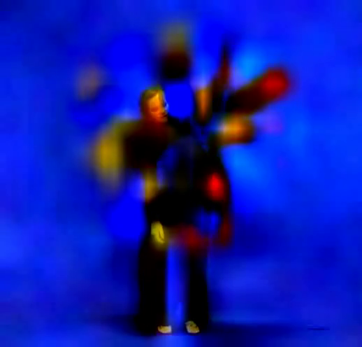
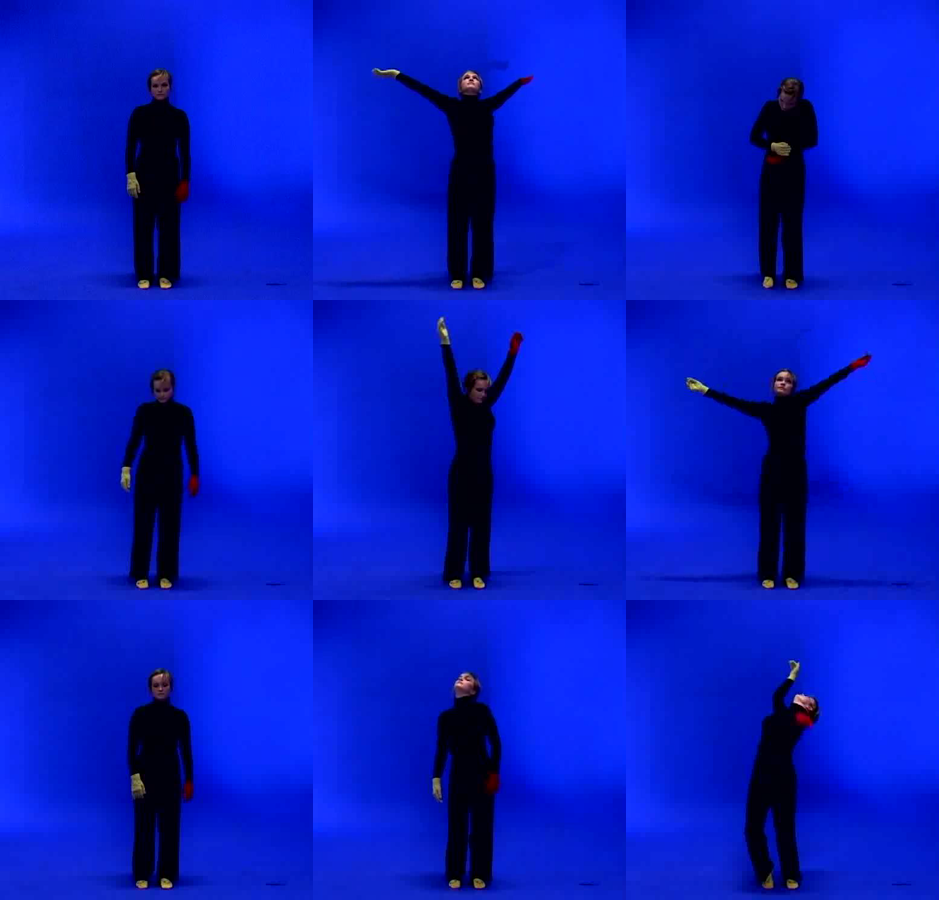
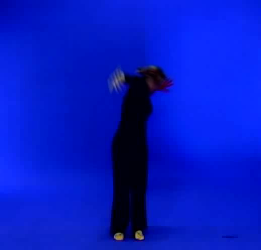

# Video Analysis

All video analysis methods are called on an `MgVideo` object. Each method writes output files alongside the source video and returns a result object you can use directly or pass to further methods.

```python
import musicalgestures as mg

mv = mg.MgVideo('/path/to/video.avi')
```

## AVI conversion (`convert`)

Most analysis methods stream frames straight through FFmpeg and run on any container, including MP4 — e.g. `motion()`, `motiongrams()`, `average()`/`blend()`, `videograms()`, `heatmap()`, `eulerian()`, `motiontempo()`, `sonomotiongram()`, `grid()`, `subtract()`, and `history()`.

A few methods that decode frame-by-frame with OpenCV first convert the input to an all-intra **MJPEG `.avi`** (cached once as `self.as_avi`) for frame-accurate decoding: `flow.dense()`/`flow.sparse()`, `directograms()`, `impacts()`, `motion_mp()`, and `history_cv2()`. The motion **video output** is also written as `.avi`.

If your MP4 decodes reliably and you want to skip that conversion (faster, no extra file), pass `convert=False`:

```python
mv = mg.MgVideo('clip.mp4')
mv.flow.dense(convert=False)
mv.directograms(convert=False)
```

For these methods the default `convert=True` keeps the safe, frame-accurate behaviour.

`pose()` is different: its `convert` defaults to `None` ("auto"). The MediaPipe backend (the default) reads the source file directly, with **no** intermediate AVI; the OpenPose backends still convert for frame-accurate decoding. The pose result video is written in the **original container** — an mp4 in gives an mp4 out, with no avi→mp4 round-trip. Pass `convert=True`/`False` to force conversion on or off regardless of backend.

---

## Threshold and filter parameters

Many methods accept `threshold` and `filtertype`:

- `threshold` (float, 0–1): pixels with a value below this fraction of 255 are set to zero. The default is `0.05`. Higher values remove more background noise but may lose subtle motion.
- `filtertype` (str): `'Regular'` (default) thresholds and median-filters; `'Binary'` binarises the output; `'Blob'` applies erosion instead.

See the [filter reference](../musicalgestures/_filter.md) for details.

---

## Motion analysis

`motion()` is the primary analysis method. It renders a motion video, horizontal and vertical motiongrams, a motion plot, and a CSV of per-frame motion data, all in one call. It returns an `MgVideo` pointing to the motion video.

```python
motion_video = mv.motion()      # returns MgVideo
motion_video.show()
mv.show(key='motion')           # equivalent shorthand
```

### Shortcuts

```python
motion_vid = mv.motionvideo()   # motion video only — returns MgVideo

motiondata = mv.motiondata()    # CSV only — returns list of paths
motiondata = mv.motiondata(motion_analysis='aom')

motionplots = mv.motionplots()  # motion plot image — returns MgImage
motionplots = mv.motionplots(audio_descriptors=True)
motionplots.show()
mv.show(key='plot')

motiongrams = mv.motiongrams()        # returns MgList[MgImage, MgImage]
motiongrams[0].show()                 # horizontal motiongram
motiongrams[1].show()                 # vertical motiongram
motiongrams.show(key='horizontal')    # select a panel by orientation
motiongrams.show(key='vertical')
mv.show(key='horizontal')             # shorthand from the source MgVideo
mv.show(key='vertical')

score = mv.motionscore()        # average VMAF motion score — returns float
```


*Horizontal motiongram: vertical motion collapsed onto the y-axis, flowing left→right over time.*


*Vertical motiongram: horizontal motion collapsed onto the x-axis, stacked top→bottom over time.*

### Motion data columns

The CSV produced by `motion()` and `motiondata()` contains one row per frame:

| Column | Description |
|---|---|
| Time | Frame timestamp in milliseconds |
| Qom | Quantity of motion (sum of active pixels) |
| ComX, ComY | Centroid of motion (normalised 0–1) |
| AomX1, AomY1, AomX2, AomY2 | Bounding box of motion area (normalised) |

---

## Motion heatmap

`heatmap()` accumulates the absolute frame-to-frame difference across the whole video into a single colour-mapped image, so hot regions mark where the most change happened. By default the heat is overlaid on a dimmed average frame for spatial context.

```python
heat = mv.heatmap()                                    # returns MgImage
heat = mv.heatmap(colormap='jet', overlay=False)       # bare heatmap on black
heat = mv.heatmap(blur=3, gamma=0.4, colormap='viridis')
heat.show()
```


*Heatmap: accumulated frame-to-frame difference, hot colours mark where the most change happened, overlaid on the dimmed average frame.*

- `colormap`: any matplotlib colormap (`'inferno'` default)
- `overlay`: composite on the dimmed average frame (default `True`); `alpha`/`background_dim` tune the mix
- `blur`: optional Gaussian smoothing radius; `gamma` (<1) boosts faint motion
- `normalize`: scale the most active pixel to the top of the colormap

---

## Space-time visualisations

Several ways to show *where* a person is and *when*, in a single image. Silhouettes are
extracted with MediaPipe selfie segmentation when available, else by background subtraction
against the average frame (best for static-camera recordings). Control extraction with
`method='auto'|'mediapipe'|'bgsub'`.

```python
# Stroboscope / chronophotography — silhouettes at sampled times on one frame
mv.stroboscope(n_samples=12).show()

# 3D silhouette waterfall — silhouette profile cascading along a time axis
mv.silhouette_waterfall(n_samples=40, axis='horizontal').show()
mv.silhouette_waterfall(axes=False).show()   # clean render, no axes/labels/title

# Motion History Image — intensity = how recently motion happened (no silhouette needed)
mv.motionhistory().show()

# 3D space-time silhouette volume — (x, y, t) point cloud
mv.spacetime_volume(n_samples=50).show()
```


*Stroboscope: silhouettes sampled at several times and composited onto a single frame (chronophotography).*


*Silhouette waterfall: the silhouette profile cascading along a time axis in 3D.*


*Motion History Image: brightness encodes how recently motion happened at each pixel (recent = bright, old = fades).*

**Cleaner silhouettes (single person on a static background).** The silhouette methods
(`stroboscope`, `silhouette_waterfall`, `spacetime_volume`) share controls: raise `threshold`
to reject background noise, tune the morphological `kernel_size`, and set `keep_largest=True`
to keep only the person's blob. If a result looks washed out / "blows up", these are the knobs:

```python
mv.stroboscope(n_samples=10, threshold=0.15, keep_largest=True).show()
```

**Motion History Image controls.** `motionhistory()` decays old motion over a window so it
doesn't accumulate and blow out: `decay` (fraction of the clip a mark persists; smaller = shorter
trails), `threshold` (motion sensitivity), `blur` (speckle suppression), and `normalize`.
`normalize` now defaults to `False` — the MHI is already built in `[0, 1]`, and normalising rarely
helps; when the final frames are static it amplified faint residual trails and over-brightened the
image. (It is also guarded to skip when peak intensity is very low.) Set `normalize=True` to opt in:

```python
mv.motionhistory(threshold=0.08, decay=0.2, blur=1).show()
```

These complement the motiongram (space×time) and the combined motion SSM (temporal structure):
the stroboscope and volume show the body moving through space over time, the waterfall shows
spatial occupancy flowing over time, and the MHI compresses recency of motion into one frame.

### Density vs. recency: `motionhistory()` vs `heatmap()` / `motion().average()`

These single-image summaries look similar but encode different things — the distinction is
**whether time order matters**:

| Visualisation | Each pixel encodes | Time order |
|---|---|---|
| `heatmap()` and `motion().average()` | **how much / how often** motion happened there (motion *density*) | **Order-independent** — reversing or shuffling the frames gives the same image |
| `motionhistory()` (MHI) | **when** motion last happened there (motion *recency*: recent = bright, old = fades) | **Order-dependent** — reversing the video inverts the image |

Concrete example — a dancer crossing the frame left → right:

- `heatmap()` / `motion().average()` → a uniformly bright band along the whole path (you can't tell which way they went).
- `motionhistory()` → a **gradient** along the path: dark where they were early, bright where they were recently — so you can read the **direction and progression** of the movement.

In short: use **`heatmap()` / `motion().average()`** for *where and how much* motion (a long-exposure of motion intensity); use **`motionhistory()`** for *where and when* (a recency map that captures the arrow of time).

Related but different: `motion().history()` (or `mv.show(key='motionhistory')`) is a **video** where each frame
carries a short motion *trail* of the last N frames (a weighted moving average), rather than a single
whole-clip summary image.

> Note: `motion()` applies your `threshold`/`filtertype` when defining motion, whereas `motionhistory()`
> uses its own simple internal frame-difference threshold — so what counts as "motion" can differ slightly.

---

## Movement tempo

`motiontempo()` estimates the dominant movement tempo from the quantity of motion (mean absolute frame difference) via an FFT, reported in both Hz and BPM.

```python
mt = mv.motiontempo()                       # returns MgFigure
print(mt.data['tempo_bpm'])                 # dominant tempo in BPM
print(mt.data['dominant_frequency'])        # in Hz
mt.show()                                   # QoM signal + movement spectrum
```


*Movement tempo: the quantity-of-motion signal and its FFT movement spectrum, with the dominant tempo marked.*

Restrict the search band with `fmin`/`fmax` (Hz).

---

## Motion vectors

`motionvectors()` visualises the motion vectors carried by inter-frame codecs (MPEG, H.264, H.265) using FFmpeg's `codecview` filter — a decoder-level view of motion with no recomputation.

```python
mvecs = mv.motionvectors()      # returns MgVideo
mvecs.show()
```

!!! note
    Intra-only formats (e.g. MJPEG in many `.avi` files) carry no motion vectors. Convert to an mp4/H.264 source first to see them.

---

## Eulerian Video Magnification

`eulerian()` amplifies subtle changes that are normally invisible (Wu et al., SIGGRAPH 2012).

```python
# Amplify subtle COLOUR changes (e.g. pulse, breathing)
evm = mv.eulerian(mode='color', freq_low=0.83, freq_high=1.0, amplification=50)

# Amplify subtle MOTION
evm = mv.eulerian(mode='motion', freq_low=0.4, freq_high=3.0, amplification=20)
evm.show()
```


*Eulerian video magnification: a single frame from the output video, with subtle changes amplified.*

- `mode='color'` uses a Gaussian pyramid + ideal FFT temporal band-pass (two-pass, low memory)
- `mode='motion'` uses a Laplacian pyramid + streaming IIR band-pass (frame-by-frame, low memory)
- `freq_low`/`freq_high` set the temporal band in Hz; `amplification` is the gain; `levels` the pyramid depth

---

## Sonomotiongram

`sonomotiongram()` sonifies the motiongram: the motiongram matrix is treated as a magnitude spectrogram (spatial position → frequency, motion intensity → amplitude) and resynthesised to audio via an inverse STFT (Griffin–Lim). It returns an [`MgAudio`](audio-analysis.md), so you can analyse or play the result.

```python
son = mv.sonomotiongram(sonogram='vertical')   # or 'horizontal' — returns MgAudio
son.waveform().show()
son.spectrogram().show()
# rendered WAV at son.filename
```

---

## Videograms

Videograms apply the motiongram technique to the source video directly, without first computing frame differences. They show the full scene content over time rather than motion only.

```python
videograms = mv.videograms()    # returns MgList[MgImage, MgImage]
videograms[0].show()            # horizontal videogram
videograms[1].show()            # vertical videogram
videograms.show(key='horizontal')
videograms.show(key='vertical')
mv.show(key='horizontal')
mv.show(key='vertical')
```


*Horizontal videogram: the full scene content (not motion) collapsed onto the y-axis, flowing left→right over time.*


*Vertical videogram: the full scene content collapsed onto the x-axis, stacked top→bottom over time.*

---

## Self-Similarity Matrix (SSM)

SSMs compare each column or row of a motiongram or videogram against all others, revealing periodic structure in the motion.

```python
motionssm = mv.ssm(features='motiongrams')              # returns MgList
motionssm = mv.ssm(features='motiongrams', cmap='viridis', norm=2)
motionssm[0].show()     # horizontal SSM
motionssm[1].show()     # vertical SSM
mv.show(key='ssm')

# both axes of motion in a single SSM (returns one MgImage)
combined = mv.ssm(features='motiongrams', combine=True)
combined.show()

videossm = mv.ssm(features='videograms')
chromassm = mv.ssm(features='chromagram', cmap='magma', norm=2)
spectrossm = mv.ssm(features='spectrogram')
```


*Combined motion SSM: both axes of motion in a single self-similarity matrix, revealing periodic structure over time.*

---

## Background subtraction

`subtract()` removes a static background from each frame. If no background image is provided, it computes the frame average automatically.

```python
subtraction = mv.subtract()                                             # returns MgVideo
subtraction = mv.subtract(bg_img='/path/to/background.png', bg_color='#ffffff')
subtraction = mv.subtract(bg_img='/path/to/background.png', curves=0.3)
subtraction.show()
mv.show(key='subtract')
```

---

## Grid preview

`grid()` assembles a strip of evenly-spaced frames into a single image, useful for quickly reviewing a recording.

```python
grid = mv.grid(height=300, rows=3, columns=3)  # returns MgImage
grid.show()
grid_array = mv.grid(height=300, rows=3, columns=3, return_array=True)
```


*Grid: a strip of evenly-spaced frames assembled into a single image for a quick overview of the recording.*

---

## History video

`history()` overlays the last `history_length` frames onto each frame, making the trajectory of motion visible.

```python
history = mv.history(history_length=20)     # returns MgVideo
history.show()
mv.show(key='history')
```


*History: a single frame from the output video, with the last `history_length` frames overlaid to trace the trajectory of motion.*

Applying history to a motion video emphasises movement traces:

```python
motionhistory = mv.motionvideo().history()
mv.show(key='motionhistory')
```

---

## Blend

`blend()` combines all frames into a single image using a compositing mode.

```python
average = mv.average()                          # returns MgImage (mean of all frames)
average = mv.blend(component_mode='average')    # equivalent
lighten = mv.blend(component_mode='lighten')
darken  = mv.blend(component_mode='darken')
average.show()
mv.show(key='blend')
```


*Average: the pixel-wise mean of every frame — a long-exposure-style summary of the whole clip.*

Motion average — blend applied to a motion video — shows where movement was concentrated:

```python
motion_average = mv.motionvideo().blend(component_mode='average')
motion_average.show()
```

---

## Pose estimation

`pose()` runs skeleton estimation on each frame, with two backends:

- **MediaPipe** (`model='mediapipe'`, the **default**): Google MediaPipe Pose, 33 landmarks with depth and visibility. Fast on plain CPU, needs no CUDA-enabled OpenCV build, and works on the standard pip OpenCV (with optional GPU via MediaPipe's own delegate). Best for single-person analysis. Model weights auto-download (~8–28 MB) on first use.
- **OpenPose** (`model='body_25'`/`'coco'`/`'mpi'`): Caffe models (~200 MB on first use). Support multi-person analysis, but are slow without an OpenCV compiled with CUDA.

```python
pose = mv.pose()                                                # MediaPipe by default
pose = mv.pose(device='gpu')                                    # MediaPipe with GPU delegate
pose = mv.pose(model='coco', device='cpu', downsampling_factor=4)   # OpenPose, multi-person
pose = mv.pose(model='body_25', device='gpu', threshold=0.1)
pose.show()
mv.show(key='pose')

# draw only the markers on a black background (no video underneath)
pose = mv.pose(style='markers', overlay=False)
# draw only the skeleton (joint lines) over the video
pose = mv.pose(style='skeleton')
# markers/skeleton on a white background (print-friendly: black skeleton + markers)
pose = mv.pose(overlay=False, background='white')
# leave a motion trail behind each marker over the last 10 frames
pose = mv.pose(marker_history=10)
```

- `model`: `'mediapipe'` (default), `'body_25'`, `'coco'`, or `'mpi'`
- `style`: `'both'` (default), `'markers'` (keypoints only), or `'skeleton'` (joint lines only)
- `overlay`: `True` (draw on the video) or `False` (draw on a plain background)
- `background`: `'black'` (default) or `'white'` — the background colour when `overlay=False`. `'black'` draws bright colours; `'white'` draws a black skeleton and markers for a print-friendly inverted look.
- `marker_history`: `0` (default) draws nothing extra; when `> 0`, draws a motion trail for each marker by joining its positions over the last N frames. Works in all render paths.
- `device`: `'cpu'` or `'gpu'`. For OpenPose models, if `device='gpu'` is requested but OpenCV lacks CUDA, `pose()` automatically switches to the MediaPipe backend (when installed) so the GPU is still used; otherwise it falls back to CPU.
- `downsampling_factor`: reduces input resolution before inference (OpenPose only); higher is faster but less accurate
- `threshold`: minimum network confidence to accept a keypoint (normalised 0–1)
- `data_format`: `'csv'` (default), `'tsv'`, `'txt'`, or `'c3d'` (motion-capture format; needs the optional `c3d` package). Combine, e.g. `data_format=['csv', 'c3d']`.
- `use_cache`: reuse keypoints from a previous `pose()` run (same model/threshold) to re-render a different `style`/`overlay`/`background` **without re-running inference** — e.g. run `style='markers'` then `style='skeleton'` and the second call is near-instant. Defaults to `True`.

```python
mv.pose(style='markers')      # runs inference, caches keypoints
mv.pose(style='skeleton')     # reuses cache — no re-inference
mv.pose(data_format=['csv', 'c3d'])   # also write a .c3d mocap file
```

`pose()` also renders two summary images of the whole video (disable with `save_average_pose=False` / `save_trajectories=False`), attached to the returned video:

```python
pv = mv.pose()
pv.average_pose.show()     # markers coloured by normalised QoM, with per-marker "QoM | frequency" labels
pv.trajectories.show()     # every marker's spatial path over the whole video
# a per-marker stats CSV (<name>_pose_average_stats.csv) with normalised QoM and frequency is also saved
```


*Average pose: markers placed at their mean position, coloured by normalised quantity of motion and annotated with a `QoM | frequency` label (no colorbar, no title).*


*Marker trajectories: every marker's spatial path over the whole video. The background follows `trajectory_background` (default `'black'`).*

Both summary images are decluttered: neither carries an in-figure title. The average-pose image no longer draws a colorbar — markers are still coloured by quantity of motion, and each one is annotated with a `QoM | frequency` number label (normalised QoM 0–1 and dominant frequency in Hz). These labels are automatically laid out so they don't overlap (with thin leader lines back to each marker). The marker-trajectories image shows **no** per-marker name labels by default (`trajectory_labels=False`); re-enable them with `trajectory_labels=True`.

Control the trajectories image background with `trajectory_background`: `'black'` (default), `'white'`, or `'transparent'` (so you can overlay the paths on the video afterwards). This supersedes the older `transparent_trajectories` flag, which is still accepted.

```python
mv.pose(trajectory_background='transparent')   # paths on a transparent PNG for overlay
mv.pose(trajectory_background='white')         # print-friendly white background
mv.pose(trajectory_labels=True)                # show marker names on the trajectories image
mv.pose(transparent_trajectories=True)         # legacy flag, still accepted
```

!!! tip "GPU acceleration"
    `pose(model='mediapipe', device='gpu')` gives GPU acceleration with the standard pip OpenCV. The OpenCV-based methods (`flow.dense(use_gpu=True)`, `blur_faces(use_gpu=True)`, OpenPose `device='gpu'`) need an OpenCV built with CUDA. Use `mg.cuda_build_available()` to check, and `mg.cuda_unavailable_reason()` for an explanation.

### Pose waterfall

`pose_waterfall()` renders a 3D spatio-temporal waterfall where each pose marker's trajectory flows through `(x, time, y)` space — a pose-based counterpart to `silhouette_waterfall()`. It returns an `MgFigure`. It reuses cached pose keypoints from a prior `pose()` call; otherwise it runs `pose()` first (pose kwargs like `model`/`device` are forwarded).

```python
wf = mv.pose_waterfall()                       # returns MgFigure ('trajectories' style)
wf = mv.pose_waterfall(color_by='time')        # colour follows time along each path
wf = mv.pose_waterfall(markers=['left_wrist', 'right_wrist'], cmap='viridis')
wf = mv.pose_waterfall(style='skeleton')       # skeleton joint lines at sampled time slices
wf = mv.pose_waterfall(style='markers', n_samples=60)
wf = mv.pose_waterfall(axes=False)             # clean render, no axes/labels
wf = mv.pose_waterfall(crop=True)              # tighten to the data, trim whitespace
wf.show()
```


*`style='trajectories'`: each marker's continuous path flowing through `(x, time, y)` space.*


*`style='skeleton'`: the skeleton joint lines drawn at `n_samples` time slices, coloured by time.*

- `style`: how the waterfall is drawn —
    - `'trajectories'` (default): continuous per-marker paths flowing through `(x, time, y)` space
    - `'markers'`: markers scattered at discrete time slices
    - `'skeleton'`: skeleton joint lines drawn per time slice
    - `'both'`: markers and skeleton lines together

  The slice-based styles (`'markers'`, `'skeleton'`, `'both'`) sample `n_samples` time slices (default `40`) and default to colour-by-time.
- `markers`: which markers to plot (default `None` = all)
- `color_by`: `'marker'` (one colour per marker) or `'time'` (colour follows time). Defaults to `'marker'` for `'trajectories'` and to `'time'` for the slice styles.
- `cmap`: matplotlib colormap (`'hsv'` default); `dpi` (default `200`); `lw` line width (default `1.0`)
- `elev`/`azim`: 3D view angles (defaults `20` / `-60`)
- `axes`: set to `False` to render without any axes, ticks, labels, or panes (a clean 3D image). Defaults to `True`. (`silhouette_waterfall()` accepts the same `axes` option.)
- `crop`: set to `True` to tighten the spatial limits to the marker extent and trim the surrounding whitespace, so the figure shows mostly the data. Defaults to `False`.
- plus the usual `target_name`, `overwrite`, and forwarded `**pose_kwargs` (e.g. `model`, `device`)

### Pose segments (circular statistics)

`pose_segments()` analyses each **body segment** — the bone between two connected joints (e.g. shoulder→elbow) — and draws a grid of circular (polar rose) plots, one per segment. For each segment it computes the per-frame orientation angle and shows a rose histogram of the angle distribution with the mean-direction resultant vector. It returns an `MgFigure` and saves a per-segment statistics CSV. Like `pose_waterfall()`, it reuses cached pose keypoints from a prior `pose()` call, otherwise runs `pose()` first (pose kwargs are forwarded).

```python
seg = mv.pose_segments()                       # returns MgFigure ('viridis' roses)
seg = mv.pose_segments(n_bins=24, cmap='magma', ncols=4)
seg = mv.pose_segments(segments=[(11, 13), (13, 15)])   # only chosen joint pairs
seg.show()

stats = seg.data['stats']                      # per-segment circular statistics
```


*Per-segment polar rose plots: the angular distribution of each bone's orientation, with the mean-direction resultant vector.*

The saved CSV (and `seg.data['stats']`) reports, per segment: mean angle, resultant length **R** (0–1, concentration of direction), circular standard deviation, range of motion, and mean angular speed.

- `segments`: list of `(a, b)` joint-index tuples to restrict the analysis (default `None` = all skeleton connections)
- `n_bins`: angular bins per rose (default `36` = 10° bins)
- `cmap`: colormap for the bars (`'viridis'` default); `ncols` sets the subplot-grid width (default `6`); `dpi` (default `200`)
- plus the usual `target_name`, `overwrite`, and forwarded `**pose_kwargs`

### Pose centring

`pose_center()` centres the pose data on its **global centroid** — a 2D port of the MoCap Toolbox `mccenter`. A single offset per coordinate (the mean of the per-marker temporal means, missing detections ignored) is subtracted from every marker so the overall spatiotemporal centroid sits at the origin. This removes the performer's absolute position in the frame, leaving relative posture/movement — useful before comparing or further analysing trajectories. It plots the centred marker trajectories, saves a CSV of the centred coordinates, and returns an `MgFigure` (the centred `(T, n, 2)` array is in `.data['coords']`, the removed offset in `.data['offset']`).

```python
pc = mv.pose_center()          # returns MgFigure (+ CSV); reuses cached keypoints or runs pose()
pc.show()
centred = pc.data['coords']    # (frames, markers, 2), centroid at the origin
```


*Each marker's trajectory after centring on the global centroid (origin marked).*

### Distance travelled

`pose_distance()` computes each marker's **cumulative distance travelled** (the sum of frame-to-frame Euclidean displacement, in pixels) plus the across-marker average — a 2D port of `mccumdist`. The figure shows the per-marker cumulative-distance curves and a ranked total-per-marker bar chart with the average marked; a CSV of the totals (and the average) is saved. `.data` holds `total` (per marker), `average`, and `cumulative` (the per-marker curves).

```python
pd_fig = mv.pose_distance()    # returns MgFigure (+ CSV)
pd_fig.show()
print(pd_fig.data['average'])  # mean distance travelled across markers (px)
```


*Left: cumulative distance travelled per marker over time. Right: total per marker, ranked, with the across-marker average.*

---

## Audio–movement analysis

MGT-python provides a suite of reports that compare a single performer's **sound** with their
**movement** — tempo similarity, phase synchrony, structural similarity, per-body-part coupling, and
loudness-vs-motion dynamics coupling — alongside the sonification and beat-warping tools. These now
have their own page:

➡️ **[Audio-Video Processing & Analysis](audio-video.md)**

```python
mv.tempo_similarity().show()      # audio tempo vs movement tempo
mv.phase_synchrony().show()       # phase-locking value (PLV)
mv.structure_comparison().show()  # audio SSM vs movement SSM + difference
mv.body_audio_coupling().show()   # which body parts track the music
mv.dynamics_coupling().show()     # audio loudness vs quantity of motion
```

---

## Optical flow

### Sparse

Sparse optical flow tracks a small set of salient feature points and draws their trajectories.

```python
flow_sparse = mv.flow.sparse()      # returns MgVideo
flow_sparse.show()
mv.show(key='sparse')
```

### Dense

Dense optical flow estimates movement at every pixel, colour-coding direction.

```python
flow_dense = mv.flow.dense()                    # returns MgVideo
flow_dense = mv.flow.dense(use_gpu=True)        # CUDA acceleration with CPU fallback
flow_dense.show()
mv.show(key='dense')
```

### Velocity

Setting `velocity=True` computes per-frame speed instead of direction, and returns an `MgFigure` with the velocity plot and associated data.

```python
velocity = mv.flow.dense(velocity=True)
velocity_per_meters = mv.flow.dense(velocity=True, distance=3.5, angle_of_view=80)
xvel = velocity.data['xvel']
yvel = velocity.data['yvel']
velocity.figure
```

---

## Face anonymisation

`blur_faces()` detects faces in every frame and applies a blur, black rectangle, or image mask.

```python
blur = mv.blur_faces()                                  # returns MgVideo
blur = mv.blur_faces(use_gpu=True)
blur = mv.blur_faces(save_data=True, data_format='csv')
blur.show()
mv.show(key='blur')

source_image = '/path/to/mask.jpg'
mv.blur_faces(mask='image', mask_image=source_image)
```

To render a heatmap of face detection centroids instead:

```python
heatmap = mv.blur_faces(draw_heatmap=True, neighbours=128, resolution=500, save_data=False)
heatmap.show()
```

---

## Warp audiovisual beats

`warp_audiovisual_beats()` temporally aligns visual beats (extracted from directograms) with audio beats to create a re-timed video.

```python
warp = mv.warp_audiovisual_beats('/path/to/audio.wav')  # returns MgVideo
warp.show()
mv.show(key='warp')
```

### Directograms

Directograms factor motion magnitude into angular bins, analogous to a spectrogram with angles replacing frequencies.

```python
directograms = mv.directograms()    # returns MgFigure
directograms.data['directogram']
directograms.show()
```


*Directogram: motion magnitude factored into angular bins over time, like a spectrogram with angles replacing frequencies.*

### Impacts

Impacts are visual analogues of audio onset envelopes, derived from directogram deceleration.

```python
impacts = mv.impacts(detection=False)                               # returns MgFigure
impacts = mv.impacts(detection=True, local_mean=0.1, local_maxima=0.15)
impacts.data['impact envelopes']
impacts.show()
```


*Impacts: the visual onset envelope derived from directogram deceleration, the movement analogue of an audio onset envelope.*

---

## Next steps

- [Audio Analysis](audio-analysis.md) — waveforms, spectrograms, and audio features
- [Working with Results](results.md) — combining and displaying MgFigure, MgImage, and MgList
- [API Reference](../musicalgestures/_motionvideo.md) — complete motion method signatures
