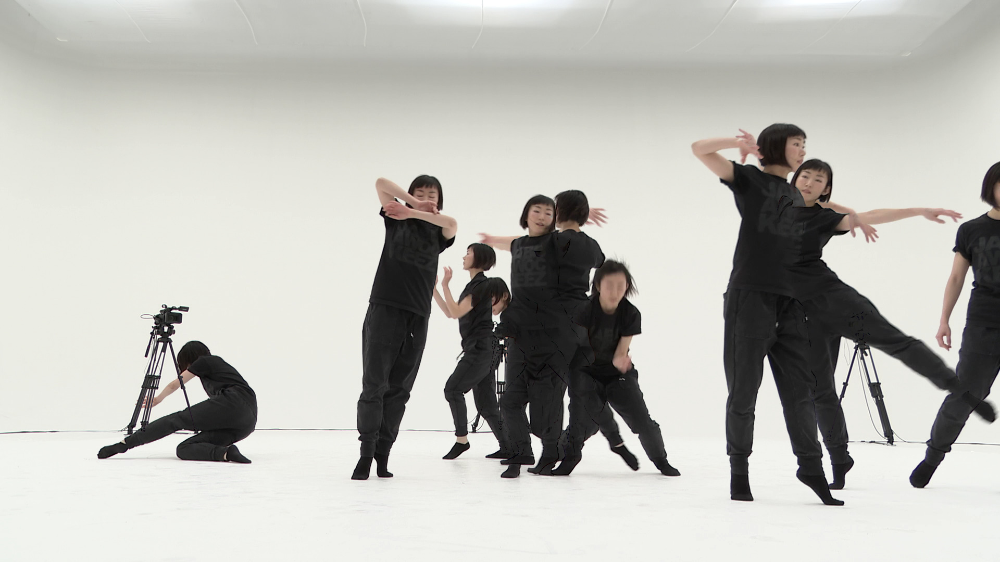

# Summary

Videos can be used to develop new visualisations to be used for analysis. The aim of creating such alternate displays from video recordings is to uncover features, structures and similarities within the material itself, and in relation to, for example, score material. Three useful visualisation techniques here are motion images, motion history images and motiongrams (\autoref{fig:motiongram}.).

MGT can generate both dynamic and static visualizations, as well as some quantitative data. A dynamic visualisation comes in the form of a video file, and includes *motion videos* and *motion history videos*. The difference between them is that the latter includes a trace of the motion over time. A   static visualisation is an image. A *motion average images* is similar to keeping the shutter open on an analog camera, which will show everything that changed over time. There are also two types of spatiotemporal displays, that is, an image that gives a sense of both time and space. A *videogram* is made from the original video, while a *motiongram* from the motion video.

In addition to the visualisations, MGT can also export some basic computer vision features, including *quantity of motion*, *centroid of motion*, and *area of motion*. These are fairly crude, and primarily useful if you have only one subject in the image.

The foundation for the techniques implemented in the toolbox was presented in `[@jensenius_actionsound:_2007]'.

# Figures

# Acknowledgements

This work was supported by the University of Oslo and the Research Council of Norway through its Centers of Excellence scheme, project numbers 250698 and 262762.

# References
